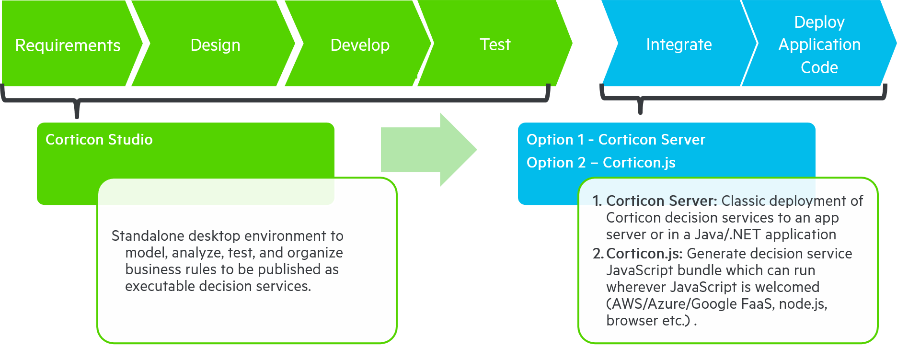

# Corticon Overview

Corticon has three main components:

- [**Corticon Studio**](https://github.com/notedhelms/docs/blob/main/rule-authoring-and-testing/corticon-studio-basics) enables you to model, test, and automate business rules within. Progress Corticon rules can then be deployed as *decision services*, made available in nearly any architectural environment by using either:
- [**Progress Corticon Server**](https://github.com/notedhelms/docs/blob/main/broken-reference) (For deploying Decision Services onto a server)—the runtime environment that hosts deployed rule models (created in Corticon Studio), exposing them as Decision Services to the external world. Decision Services can be exposed as Web services (SOAP or REST), Java services, or .NET services.
- [**Corticon.js**](https://github.com/notedhelms/docs/blob/main/broken-reference) (For serverless environments)- Corticon is able to package business rules as executable JavaScript bundles (created in Corticon.js Studio), without any external dependencies. These bundles include both the business rules and the rule engine and can be run in any browser application client-side.
