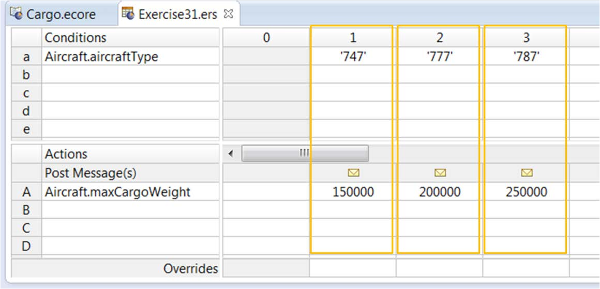
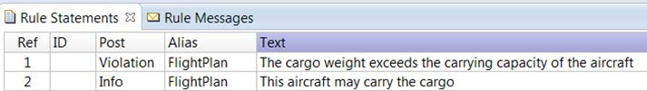
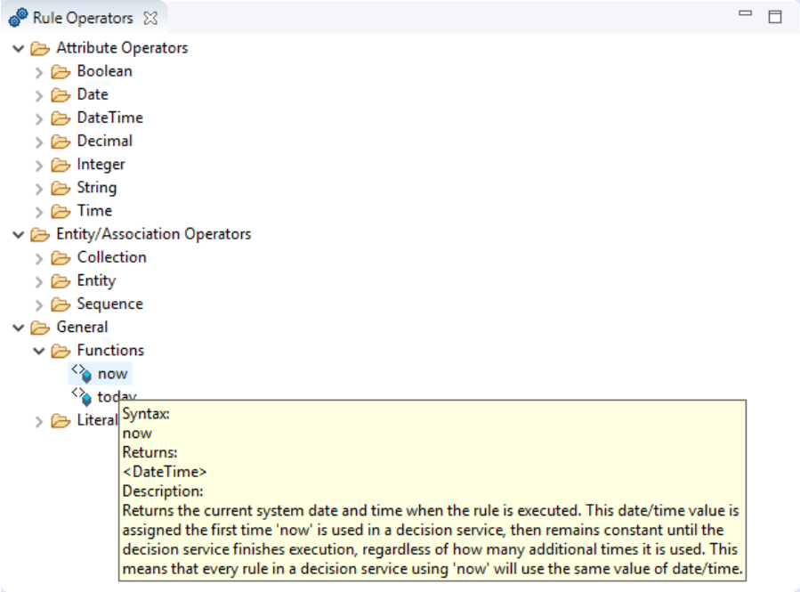
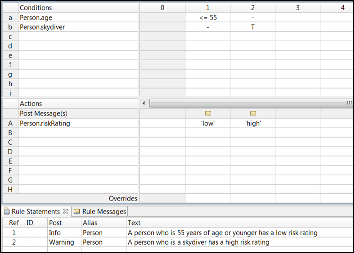
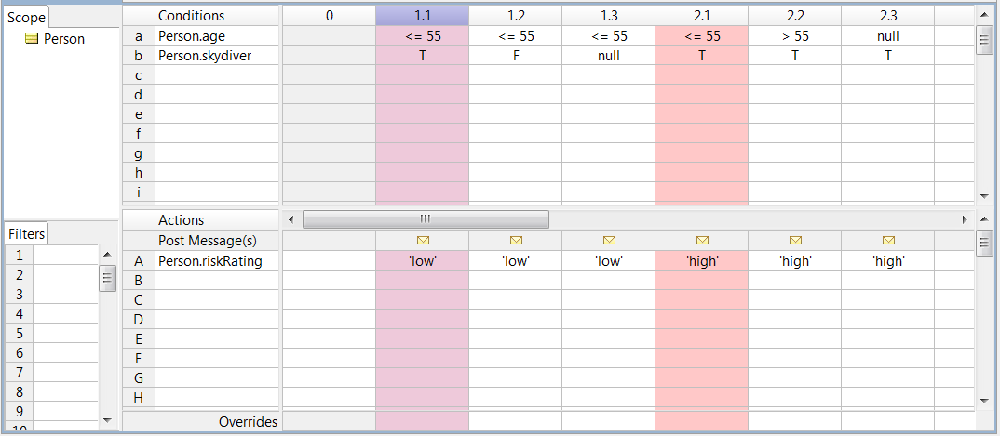
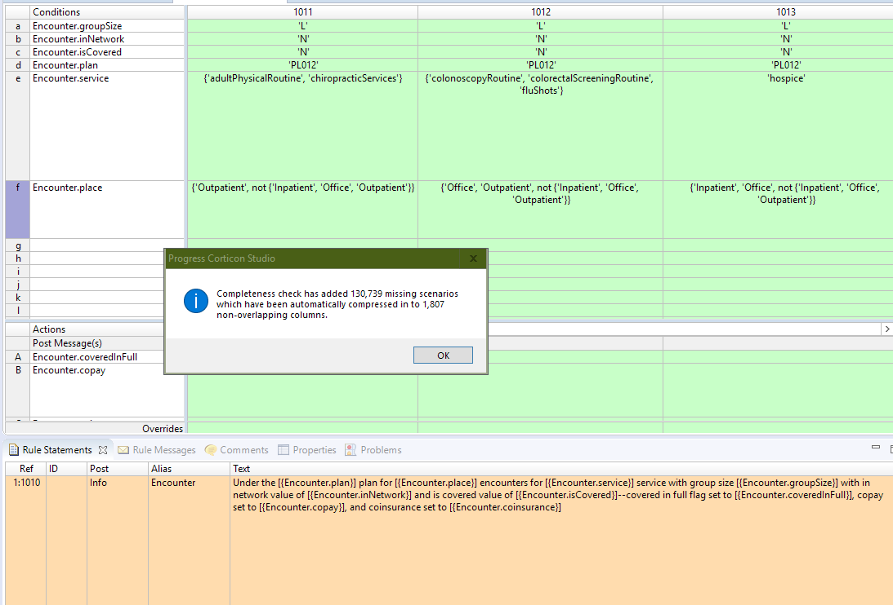
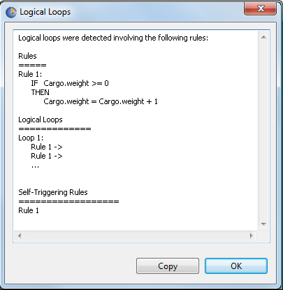

# Rulesheets

## Parts of a Rulesheet

**Rulesheets** are like Decision Tables. Users 'model' the business rules, where the rule is like an ‘if-then’ statement. Each rule consists of one or more conditions (if) that are associated with one or more actions (then).

Here is an example of a Rulesheet with three rules. The Rulesheet editor has the following parts:

* **Conditions**—where you define the conditions for each rule. For example, `Aircraft.aircraftType` = 747. The condition value could be a single value (747), a set of values (747, 777, 787), or a range of values (weight=100000..200000).
* **Actions**—where you define the actions that need to be triggered when the conditions are satisfied. For example, `Aircraft.maxCargoWeight`=150000.
* **Rule columns**—the highlighted columns in this image. Each column represents a rule. It associates a set of conditions with a set of actions. For example, column 1 defines the rule—if the aircraft is a 747, then its maximum cargo weight is 150,000.

The terms `Aircraft.aircraftType` and `Aircraft.maxCargoWeight` come from the Rule Vocabulary. Each Rulesheet must be linked to a Rule Vocabulary.

Corticon evaluates all the conditions in each rule. If all the conditions in the rule are satisfied, the actions in the rule are triggered. 

_Note: If an action does not execute for some reason, Corticon still tries to execute the other actions in the rule._

## Rule Statements

Each rule is documented with **Rule Statements**. Rule Statements will be sent along with the new/changed data resulting from the rules in the response from Corticon back to the calling application. Rule statements will only be sent back to the calling application if that rule was triggered as part of that decision's execution.

Note that you can define multiple rule statements for a single rule. For example, one rule statement can document the rule, while another is sent as part of the output message when the rule fires

## Rule Operators

When you use your Vocabulary to build rules, you also make use of rule operators such as =, <, and . Corticon Studio provides a rich set of predefined rule operators in the Rule Operators view. By default, this view is located at the bottom-left of the Corticon Designer perspective.

The Rule Operators view organizes operators into folders based on their function and purpose. For example, the Attribute Operators folder contains subfolders for different data types. The folder for each data type contains rule operators that you can use when defining rules that use attributes of that data type.

You can learn about each rule operator in the Rule Operators view by hovering the mouse pointer over it. A tooltip appears, describing the rule operator, as shown in this image. The Rule Language Guide in the documentation set provides details of all rule operators available in Corticon Studio.

---

## Logical Integrity Checks

_Instead of having to find problems during user acceptance testing or production, Corticon enables you to find them during the design or development phase, which saves you time and money._

Rulesheets  provide rule modelers with multiple click-of-a-button **Logical Integrity Checks** which identify incompleteness, conflict between rules, and infinite loops. For example, the rule completeness check on the below rule sheet reveals scenarios which are plausible based upon the rules we have thus far.

### Rule Conflicts

A conflict occurs when two or more rules overlap in some way. They have condition expressions that apply to the same input data in some scenarios, but have different actions that need to be performed on that data. For example, consider the following rules:

* A person who is less than or equal to 55 years of age has a low risk rating.
* A person who is a skydiver has a high risk rating.

These rules conflict with each other because a person who is, for instance, 45 years old and also a skydiver, satisfies the conditions of both the rules. So which rule fires?

In Corticon, if two or more rules are in conflict, and data is received that satisfies the conditions of all the conflicting rules, they all fire.

However, the rules do not fire concurrently. They fire in a sequence. The rule that fires first updates the value of the attribute or attributes at the center of the conflict (in this example riskRating). The rule that fires next updates the value of the attribute or attributes again and so on until the last conflicting rule fires and the attribute is sent in an outgoing response message.

In addition, all rule statements linked to the rules that fire are sent as rule messages in the response message. In this example, instance 3 in the input data triggers the first rule (with the condition Person.age <= 55) first, which updates the riskRating value to low. However, it also triggers the second rule (with the condition Person.skydiver = true) which fires next and updates the value of the riskRating attribute to high. The output panel in the Ruletest reflects only the latest value.

Note that since all conflicting rules fire, all rule statements linked to the rules are sent as rule messages. If you look closely at the image of the Ruletest, you will see that instance 3 generates two rule messages—one for each rule fired.

#### Check and resolve conflicts in a Rulesheet

A conflict occurs when two or more rules overlap in some way. They have condition expressions that apply to the same input data in some scenarios, but have different actions that need to be performed on that data.

The rules in this Rulesheet conflict with each other because a person who is, for instance, 45 years old and also a skydiver, satisfies the conditions of both the rules.

To perform a conflict check, open the Rulesheet, and click on the Check for Conflicts icon or select Rulesheet > Logical Analysis > Check for Conflicts.

#### Expand rules

When you define a rule in a Rulesheet, Corticon Studio creates sub-rules that address different scenarios that are within the boundaries of the rule. The sub-rules are hidden by default. However, you can view the sub-rules by expanding the ‘main’ rule.

To do this you must double-click the column number in the main rule. The sub-rules are numbered by adding a decimal point to the main rule’s column number (if the main rule is in column 1, the sub-rules are numbered 1.1, 1.2, 1.3, etc).
Each sub-rule addresses one scenario within the main rule. In this example, both rules are expanded. Consider the rule that verifies if a person is less than or equal to 55 years of age and assigns a low risk rating. Since, in this rule, it does not matter if the person is a skydiver, Corticon Studio identifies three scenarios1 within the rule:

* Where Person.age <= 55 and Person.skydiver = true (sub-rule 1.1)
* Where Person.age <= 55 and Person.skydiver = false (sub-rule 1.2)
* Where Person.age <= 55 and Person.skydiver = null (sub-rule 1.3)

Similarly, the rule that verifies if a person is a skydiver or not is expanded into three subrules. As you can see here, sub-rule 1.1 conflicts with sub-rule 2.1. In this case, the conflict is quite clear—the condition expressions in these rules are the same but the action is different. Sub-rules give you clarity about the cause of the conflict. Based on this, you can decide what steps to take to resolve the conflict.

Conflicts are not necessarily wrong. Whether or not you have to resolve them depends on their context and the business requirement. Only the domain or subject matter expert responsible for articulating the rules will know for sure.

If you do need to resolve the conflicts, you can choose to do one of the following things:

* Delete one or more of the conflicting rules until there are no conflicts in the Rulesheet.
* Modify the condition or actions to resolve the conflict.
* Specify overriding behavior.

Again, how you choose to resolve a conflict depends on the context and business requirements.

#### Specify overriding behavior

You can specify one rule to override another if they are in conflict. During testing or in production, if data satisfies the conditions in both rules, only the rule that overrides the other will fire. To specify overriding you must:

1. Identify which rule or sub-rule you want to ‘keep’ and which rule or sub-rule you want to override.
2. Click the Overrides cell in the rule column of the rule or sub-rule that you want to keep. A drop-down list appears, displaying a list of all rules or sub-rules in the Rulesheet that can be overridden.
3. Select the rule or sub-rule that you want to override.

### Rule completeness

Typically, you define multiple rules in the same Rulesheet because they have something in common. They address different aspects of a decision point, for example, risk rating in the insurance underwriting exercise. The rules cover different aspects of the decision— what risk rating to give to a person based on criteria such as the age of the person, whether the person is a skydiver or not, etc.

Based on the rules that you define, Corticon Studio detects if any scenarios are missing. For instance, if you have defined that a person less than or equal 55 years of age has a low risk, Corticon Studio detects that the scenario “greater than 55” is missing.

Corticon Studio has a built-in completeness checking algorithm that calculates the set of all possible mathematical combinations of all values in all conditions. The algorithm then compares this set of possible combinations to those already specified in the Rulesheet and detects missing combinations.

#### Check and resolve incomplete rules

To perform a conflict check, open the Rulesheet, and click on the Check for Completeness icon or select Rulesheet > Logical Analysis > Check for Completeness.

After you run a completeness check, either of the following may happen:

* If there are no missing scenarios, Corticon Studio displays a dialog box indicating that the Rulesheet is complete and no new rules are added.
* If there are missing scenarios, Corticon Studio:
  * Displays a dialog box indicating the number of missing scenarios found and the number of rules added.
  * Highlights the newly added rules in green, as shown in the image.

You can expand and view the sub-rules of the newly added rules. Examine these subrules and see if the missing scenarios that they address are valid or not.

#### Act on newly added rules

Like a conflict, incompleteness is not necessarily wrong—only a subject matter expert can decide. For example, consider a Rulesheet with rules that determine fetal risk for pregnant women. Suppose the gender attribute used in these rules is an enumerated custom data type with two possible values—male and female. You may define rules for scenarios where the value of the gender attribute is female, but Corticon Studio will detect missing scenarios for the value male.

You can resolve incompleteness in one of the following ways:

* If the newly added rules suit your requirements, you can keep them.
* If they don’t meet your requirements you can:
  * Delete them, or,
  * Disable them, and write rule statements to document the scenarios.

#### Disable rules

Sometimes you may want to keep newly added rules in a Rulesheet but only for reference so that you know which scenarios you want to leave out of the decision-making process. You can disable a rule by right-clicking the column number and selecting Disable. You can optionally write a rule statement and link it to the disabled rule to document the scenario.

### Rulesheet optimization

Typically, you do not have to worry about optimizing Rulesheet execution because both rule compilation and rule execution are efficient and fast. The only time you should consider optimizing a Rulesheet is:

* When it contains a very large number of columns, and,
* You want rules to be processed in the fastest possible time.

The way to optimize a Rulesheet is by compressing rules. You compress rules by clicking the Compress Rules icon in the Rulesheet.

Compression creates hyphens wherever possible in rule column cells by looking for overlap among rule columns with specific data and summarizing them into fewer columns. Compressing Rulesheets helps improve efficiency, but does not affect a Rulesheet’s logical operation. Note, however, that compressing a Rulesheet can change the way columns look and possibly make them less familiar to you and harder to maintain.

#### Identifying dependencies in the Rulesheet

The Logical Dependency Graph is a flowchart-like display of how rules in a Rulesheet execute and which attributes are updated at which point in the execution process.

The Logical Dependency Graph is contained in a GIF file. You open it by selecting Rulesheet > Logical Analysis > Logical Dependency Graph.

The Logical Dependency Graph displays attributes in elliptical shapes and rule column numbers in squares. Arrows link the attributes and squares, denoting the sequence in which the rules execute and in which the attributes acquire their values, either from rule execution or from input data.

Generally, if an attribute does not have an arrow leading to it, it means the value of that attribute is retrieved from input data. An arrow from an attribute to a rule means that the value of the attribute is passed to the rule, which then processes the value in some way. An arrow from a rule to an attribute means that the attribute value is assigned or updated as a result of the rule firing.

So how do you spot dependencies in the Logical Dependency Graph? If rules are in the same logical path or chain—where the chain of arrows eventually lead from one rule to the other—there is dependency. The first rule in a chain is an independent rule. All rules that follow are dependent.

#### Execution Sequence Diagram

The Execution Sequence Diagram displays the order in which rules are executed based on the logic in the Rulesheet.

The Execution Sequence Diagram is contained in a GIF file. You open it by selecting Rulesheet > Logical Analysis > Execution Sequence Diagram.

Dependent rules fire in a sequence that is different from independent rules. So by taking a quick glance at the Execution Sequence Diagram you should be able to tell if there are any dependent rules.

The best way to use the Execution Sequence Diagram and the Logical Dependency Graph is to first check the diagram for anomalies and then inspect the graph to understand where the dependencies exist.

### Loops

To help identify inadvertent loops, Corticon Studio provides a Check for Logical Loops tool in the Corticon Studio toolbar. The tool contains a powerful algorithm that analyzes dependencies between rules on the same Rulesheet, and reports discovered loops to the rule modeler. For the Loop Detector to notice mutual dependencies, a Rulesheet must have looping enabled using one of the choices described earlier.

Clicking the Check for Logical Loops icon displays a window that describes the mutual dependencies found on the Rulesheet. To illustrate loop detection, we will use a few of the same examples from before.

When applied to a Rulesheet containing just the single-rule loop shown in this figure, the Check for Logical Loops tool displays the following window:
Figure 2. Checking for Logical Loops in a Rulesheet
Figure 3. A Single-Rule Loop Detected by the Check for Logical Loops Tool

The Check for Logical Loops tool first lists rules where mutual dependencies exist. Then, it lists the distinct, independent loops in which those rules participate, and finally it lists where self-triggering rules exist (if any). In this simple single-rule loop example, only one rule contains a mutual dependency, and only one loop exists in the Rulesheet.

Note: The Check for Logical Loops tool does not automatically fix anything, it just points out that our rules have loops, and gives us an opportunity to remove or modify the offending logic.
