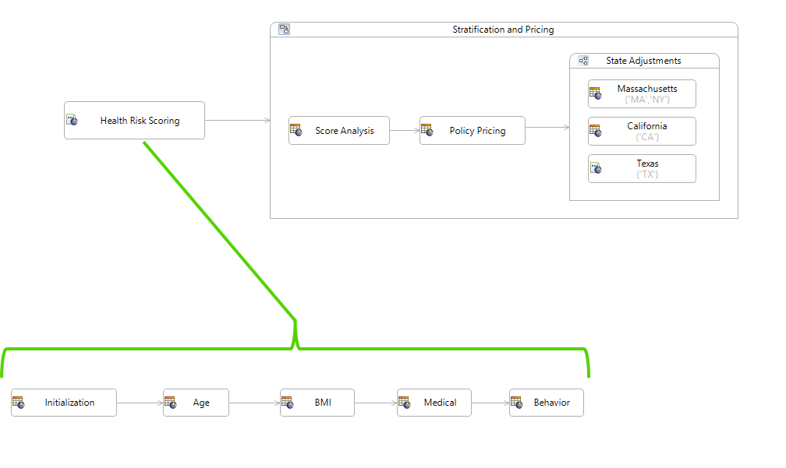

# Ruleflow Best Practices

### Designing for Reusability
.png)
Rules are grouped into separate rulesheets based on expertise of the SME that will maintain each rulesheet, and potential for reuse

#### Nesting 

Ruleflows can be nested


#### Branching
.png)
Ruleflows can use Branch objects to enable conditional routing of ruleflow execution



