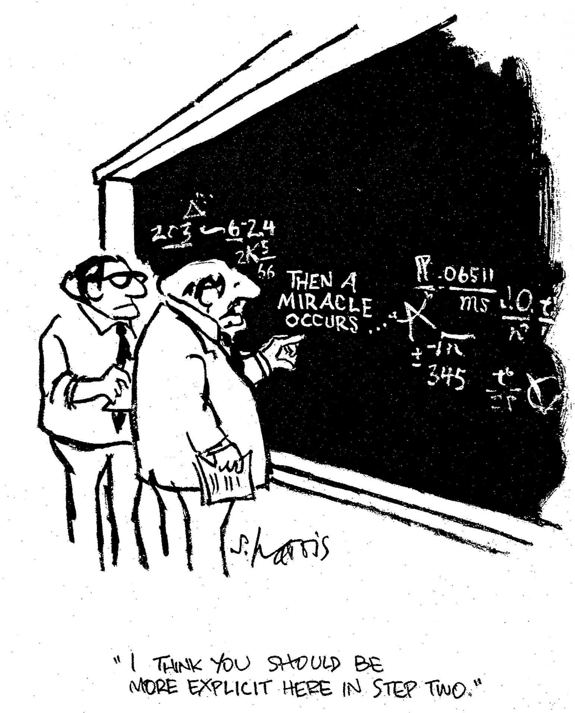

# Corticon Decision Magement

Corticon, is a low-code, model-driven approach for creating and managing business rules that is targeted at businesspeople, subject-matter experts, and business analysts rather than application developers.

  

## Corticon Components

Corticon is broken out into rule definition and rule execution components. Rules are designed, logically analyzed, documented, sequenced, and tested in **[Corticon Studio](studio)**, along with any configurations for accessing/operating upon external datasources.

Rules are then either:

1) **[Corticon Server Deployment](server/)**: Deployed as stateless decision services on a Corticon Server, exposed as web services or embedded within a Java application.
2) **[Corticon.js Deployment](js/)**: Transpiled into a self-contained JavaScript bundle, runnable wherever JavaScript is supported.

 
 

  

