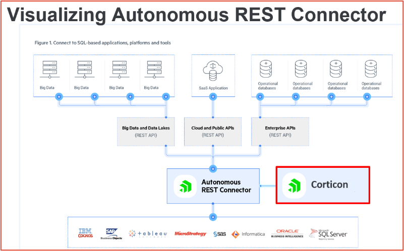

# REST Data Connectivity

Finally, there is REST/JSON connector based on the Autonomous REST Connector (ARC) to pull data from external or internal APIs. The ARC driver built into Corticon 6.0, transforms a REST/JSON structure into an in-memory database representation. This database is then query-able using the same techniques already present in Corticon. So, SQL goes in at one end and the other end attaches to REST endpoints. A
The Corticon REST Datasource uses the DataDirect [Autonomous REST Connector ](https://www.progress.com/connectors/autonomous-rest-connector)which provides the ability to access REST services as if they were databases. This is beneficial to a Corticon user because the process of mapping a vocabulary to a REST service is the same as for EDC and ADC data sources.

## Mapping vocabulary to a REST datasource

To configure the REST Datasource you either perform schema discovery or supply your own schema file. When using schema discovery, you supply the URL of the REST data source and query parameters and allow the Autonomous REST Connector to generate a schema for your REST service. To supply your own schema, you can either export a discovered schema from Corticon Studio and make edits or create one from scratch. See the[ Autonomous REST Connector documentation](https://docs.progress.com/bundle/corticon-data-integration/page/Overview-of-the-Autonomous-REST-Connector.html) for details on the its schema file format.

The query parameters for a REST Datasource can either be fixed or dynamically set by data in your payload. Dynamic setting of parameters allows you to access a REST service to retrieve information about a specific entity in your payload. You can also configure the security settings for accessing a REST service.

As REST access is limited to read-only, it is ideal for data enrichment. You could have one or several REST Datasources used by a decision service. You can even mix EDC or ADC with REST depending on your data access needs.

The wealth of REST data sources exposed through APIs means that you could be touching multiple sources to build the best complete data set possible. In marketing scenarios that might mean taking sparse info on a prospect from social or business contacts to enrich the data by discovering their profile and preferences to focus campaigns and assign local reps for follow-up. In medical applications, diagnoses and treatments can be enriched with claims approval histories or related clinical trials. For mortgage lenders, quickly scanning multiple credit review resources for a prospect, and then matching their home value and loan to retrieve the best rate from multiple lenders.
