# Rulesheets

You define your rule logic in a Corticon Rulesheet. A rule is like an ‘if-then’ statement.
Each rule consists of one or more conditions (if) that are associated with one or more
actions (then).
Here is an example of a Rulesheet with three rules. The Rulesheet editor has the following
parts:

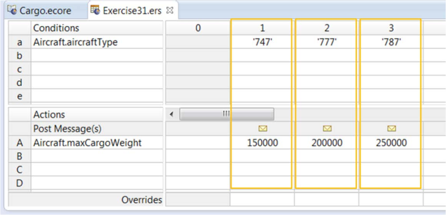

- Conditions—where you define the conditions for each rule. For example, Aircraft.aircraftType = 747. The condition value could be a single value (747), a set of values (747, 777, 787), or a range of values (weight=100000..200000).
- Actions—where you define the actions that need to be triggered when the conditions are satisfied. For example, Aircraft.maxCargoWeight=150000.
- Rule columns—the highlighted columns in this image. Each column represents a rule. It associates a set of conditions with a set of actions. For example, column 1 defines the rule—if the aircraft is a 747, then its maximum cargo weight is 150,000.

The terms Aircraft.aircraftType and Aircraft.maxCargoWeight come from the Rule Vocabulary. Each Rulesheet must be linked to a Rule Vocabulary.
Corticon evaluates all the conditions in each rule. If all the conditions in the rule are
satisfied, the actions in the rule are triggered.

Note: If an action does not execute for some reason, Corticon still tries to execute the other actions in the rule

## Defining rules in a Rulesheet

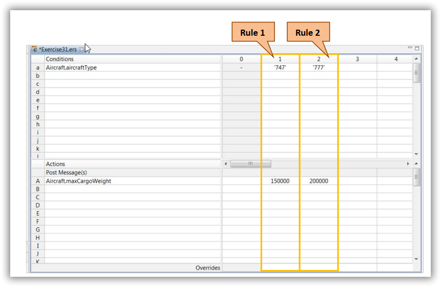

To define rules in the Rulesheet, you:

- Drag and drop Vocabulary terms for conditions and actions as follows:
  1. Select the Vocabulary term from the Rule Vocabulary view.
  2. Drag and drop the term to the next empty cell in the Conditions or Actions pane. Each Vocabulary term must go into a separate row.
- Specify condition and action values for each rule in the rule columns as follows:
  1. Double-click the cell that corresponds with the Vocabulary term.
  2. Enter the value.

When you specify a value in a rule column cell, the equality operator is implied. For example, when you enter 747 in column 1 as shown here, it means (if) Aircraft.aircraftType = ‘747’

## Rule Statements

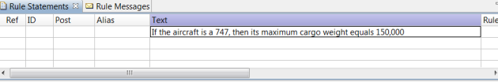

A rule statement serves the following purposes:

- Writing the rule in plain or informal language enables you to articulate the rule quickly and prepares you for the next step—defining the rule formally. You can also use the rule statement to identify Vocabulary terms that you need in the rule.
- The rule statement can be made a part of the output message sent by Corticon when the rule fires. The rule statement describes the rule, so users can understand the action or actions that are triggered by the rule by reading the rule statement in the output message.
- Finally, a rule statement is a way to document a rule so that stakeholders can understand its purpose and logic by reading the rule statement.

Note that you can define multiple rule statements for a single rule. For example, one rule statement can document the rule, while another is sent as part of the output message
when the rule fires. Follow these steps to create a rule statement:

1. Open the Rulesheet in Corticon Studio. The Rule Statements view becomes active
2. The Rule Statements view comprises several rows and columns. To create the rule statement, double-click a cell in the column named Text and type the rule statement

### Link a rule with a rule statement

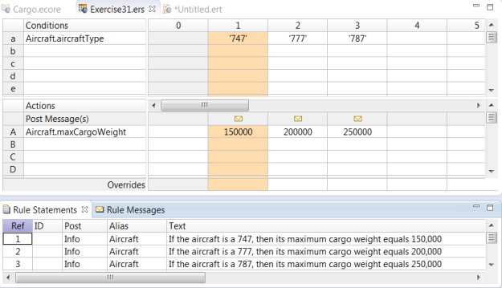

You must explicitly link each rule statement with its rule. To link a rule statement with its rule, enter the number of the rule column in the rule statement's **Ref** cell.
If you only want to document the rule, you do not need to configure any other properties.
If you want to post the rule statement as part of the output message, configure these properties:

- **Post**: The Post property enables you to indicate the severity of the rule violation. You can select from three levels—Info, Warning, and Violation. Note that these severity levels are user-defined and have no special meaning in Corticon. You can define them to match your requirements.
- **Alias**: Specify the Vocabulary entity in the rule condition that you want displayed with the output message when there is a rule violation.

After you link a rule statement with a rule, when you select the rule statement in the **Rule Statements** view, the corresponding rule column is highlighted in orange. Similarly, if you select a cell or a group of cells within the rule column, the corresponding rule statement is highlighted in orange. This indicates that the rule statement and the rule are linked.

## Syntax for values in rule column cells

The values that you specify must conform to the following syntax:

- If the Vocabulary term’s data type is String, Date, DateTime, or Time, the corresponding value in the rule column must be enclosed in single quotes.

  - CORRECT: ‘apple’
  - INCORRECT: “apple”, apple
- If the Vocabulary term’s data type is Integer, the corresponding value must not be enclosed in quotes and it must not contain decimal points or delimiters.

  - CORRECT: 4, -4
  - INCORRECT: 4.0, ‘4’
- If the Vocabulary term is Decimal, the corresponding value can contain a decimal point, but the decimal point is optional. Commas are not allowed, and the value must not be enclosed in quotes.

  - CORRECT: 10, -10.0, 10.5
  - INCORRECT: 10,25, 1,025.00
- If the Vocabulary term is Boolean, the corresponding value can only be T, F, true, or false. The value must not be enclosed in quotes. The case does not matter.

  - CORRECT: t, F, FALSE
  - INCORRECT: ‘false’

## Logical Integrity Checks

Rulesheets also provide rule modelers with multiple click-of-a-button **Logical Integrity Checks** which identify incompleteness, conflict between rules, and infinite loops. For example, the rule completeness check on the below rule sheet reveals scenarios which are plausible based upon the rules we have thus far.

### Rule Conflicts

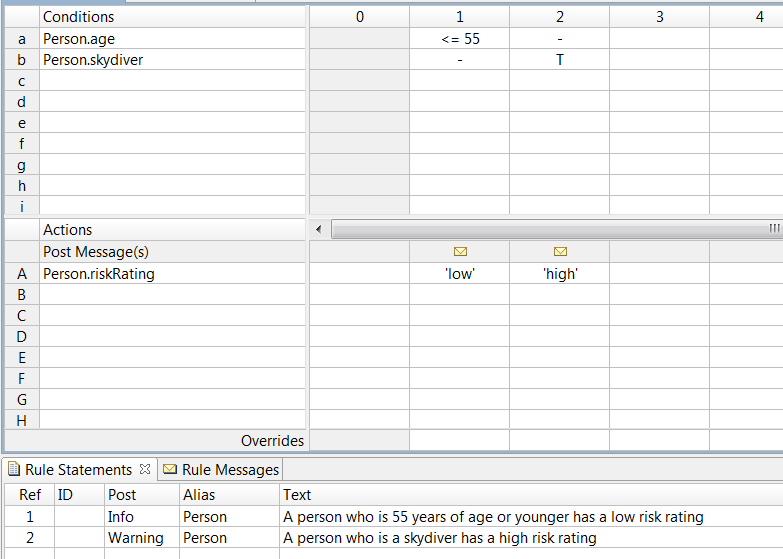

A conflict occurs when two or more rules overlap in some way. They have condition expressions that apply to the same input data in some scenarios, but have different actions that need to be performed on that data. For example, consider the following rules:

* A person who is less than or equal to 55 years of age has a low risk rating.
* A person who is a skydiver has a high risk rating.

These rules conflict with each other because a person who is, for instance, 45 years old and also a skydiver, satisfies the conditions of both the rules. So which rule fires?

In Corticon, if two or more rules are in conflict, and data is received that satisfies the conditions of all the conflicting rules, they all fire.


However, the rules do not fire concurrently. They fire in a sequence. The rule that fires first updates the value of the attribute or attributes at the center of the conflict (in this example riskRating). The rule that fires next updates the value of the attribute or attributes again and so on until the last conflicting rule fires and the attribute is sent in an outgoing response message.

In addition, all rule statements linked to the rules that fire are sent as rule messages in the response message. In this example, instance 3 in the input data triggers the first rule (with the condition Person.age <= 55) first, which updates the riskRating value to low. However, it also triggers the second rule (with the condition Person.skydiver = true) which fires next and updates the value of the riskRating attribute to high. The output panel in the Ruletest reflects only the latest value.

Note that since all conflicting rules fire, all rule statements linked to the rules are sent as rule messages. If you look closely at the image of the Ruletest, you will see that instance 3 generates two rule messages—one for each rule fired.

#### Check and resolve conflicts in a Rulesheet

To perform a conflict check, open the Rulesheet, and click on the Check for Conflicts icon or select Rulesheet > Logical Analysis > Check for Conflicts.


When you check for conflicts, either of the following things may happen:

* If there are no conflicts, Corticon Studio displays a dialog box indicating that no conflicts were found.
* If there are conflicts in the rules, Corticon Studio:
  * Displays a dialog box indicating the number of conflicts detected
  * Highlights the rules that are in conflict in pink, as shown in this image

Examine the conflicting rules closely. Are you able to spot the cause of the conflict? Sometimes, the rules are framed in such a way that it may be difficult to think of a scenario that may be causing the conflict.

However, in Corticon Studio, you can find the exact scenario that is causing the conflict.

#### Expand rules

When you define a rule in a Rulesheet, Corticon Studio creates sub-rules that address different scenarios that are within the boundaries of the rule. The sub-rules are hidden by default. However, you can view the sub-rules by expanding the ‘main’ rule.

To do this you must double-click the column number in the main rule. The sub-rules are numbered by adding a decimal point to the main rule’s column number (if the main rule is in column 1, the sub-rules are numbered 1.1, 1.2, 1.3, etc).

Each sub-rule addresses one scenario within the main rule. In this example, both rules are expanded. Consider the rule that verifies if a person is less than or equal to 55 years of age and assigns a low risk rating. Since, in this rule, it does not matter if the person is a skydiver, Corticon Studio identifies three scenarios1 within the rule:

* Where Person.age <= 55 and Person.skydiver = true (sub-rule 1.1)
* Where Person.age <= 55 and Person.skydiver = false (sub-rule 1.2)
* Where Person.age <= 55 and Person.skydiver = null (sub-rule 1.3)

Similarly, the rule that verifies if a person is a skydiver or not is expanded into three subrules. As you can see here, sub-rule 1.1 conflicts with sub-rule 2.1. In this case, the conflict is quite clear—the condition expressions in these rules are the same but the action is different. Sub-rules give you clarity about the cause of the conflict. Based on this, you can decide what steps to take to resolve the conflict.


Conflicts are not necessarily wrong. Whether or not you have to resolve them depends on their context and the business requirement. Only the domain or subject matter expert responsible for articulating the rules will know for sure.

If you do need to resolve the conflicts, you can choose to do one of the following things:

* Delete one or more of the conflicting rules until there are no conflicts in the Rulesheet.
* Modify the condition or actions to resolve the conflict.
* Specify overriding behavior.

Again, how you choose to resolve a conflict depends on the context and business requirements.

#### Specify overriding behavior

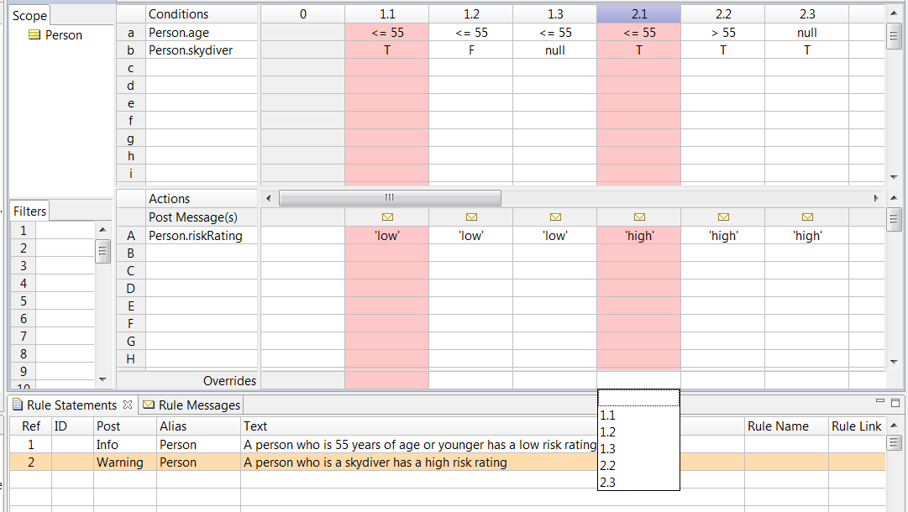

You can specify one rule to override another if they are in conflict. During testing or in production, if data satisfies the conditions in both rules, only the rule that overrides the other will fire. To specify overriding you must:

1. Identify which rule or sub-rule you want to ‘keep’ and which rule or sub-rule you want to override.
2. Click the Overrides cell in the rule column of the rule or sub-rule that you want to keep. A drop-down list appears, displaying a list of all rules or sub-rules in the Rulesheet that can be overridden.
3. Select the rule or sub-rule that you want to override.

In this example, the high risk rating (assigned for a skydiver) should override the low risk rating (assigned for persons <= 55 years of age), so rule column 2.1 should overrides rule column 1.1

### Rule completeness

Typically, you define multiple rules in the same Rulesheet because they have something in common. They address different aspects of a decision point, for example, risk rating in the insurance underwriting exercise. The rules cover different aspects of the decision— what risk rating to give to a person based on criteria such as the age of the person, whether the person is a skydiver or not, etc.

Based on the rules that you define, Corticon Studio detects if any scenarios are missing. For instance, if you have defined that a person less than or equal 55 years of age has a low risk, Corticon Studio detects that the scenario “greater than 55” is missing.

Corticon Studio has a built-in completeness checking algorithm that calculates the set of all possible mathematical combinations of all values in all conditions. The algorithm then compares this set of possible combinations to those already specified in the Rulesheet and detects missing combinations.

#### Check and resolve incomplete rules

To perform a conflict check, open the Rulesheet, and click on the Check for Completeness icon or select Rulesheet > Logical Analysis > Check for Completeness.

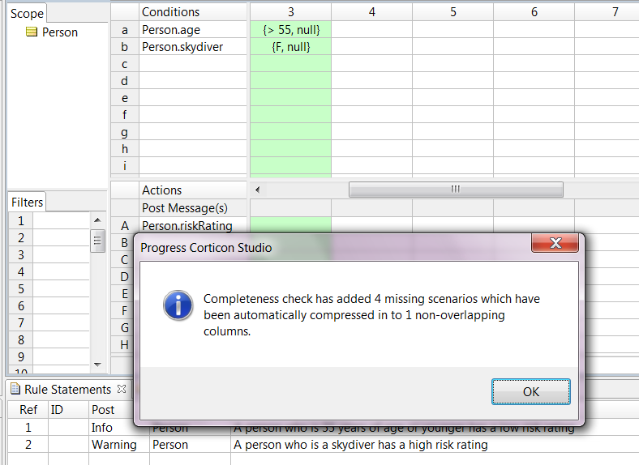

After you run a completeness check, either of the following may happen:

* If there are no missing scenarios, Corticon Studio displays a dialog box indicating that the Rulesheet is complete and no new rules are added.
* If there are missing scenarios, Corticon Studio:
  * Displays a dialog box indicating the number of missing scenarios found and the number of rules added.
  * Highlights the newly added rules in green, as shown in the image.

You can expand and view the sub-rules of the newly added rules. Examine these subrules and see if the missing scenarios that they address are valid or not.

#### Act on newly added rules

Like a conflict, incompleteness is not necessarily wrong—only a subject matter expert can decide. For example, consider a Rulesheet with rules that determine fetal risk for pregnant women. Suppose the gender attribute used in these rules is an enumerated custom data type with two possible values—male and female. You may define rules for scenarios where the value of the gender attribute is female, but Corticon Studio will detect missing scenarios for the value male.

You can resolve incompleteness in one of the following ways:

* If the newly added rules suit your requirements, you can keep them.
* If they don't meet your requirements you can:
  * Delete them, or,
  * Disable them, and write rule statements to document the scenarios.

#### Disable rules


Sometimes you may want to keep newly added rules in a Rulesheet but only for reference so that you know which scenarios you want to leave out of the decision-making process. You can disable a rule by right-clicking the column number and selecting Disable. You can optionally write a rule statement and link it to the disabled rule to document the scenario.

#### Rulesheet optimization

Typically, you do not have to worry about optimizing Rulesheet execution because both rule compilation and rule execution are efficient and fast. The only time you should consider optimizing a Rulesheet is:

* When it contains a very large number of columns, and,
* You want rules to be processed in the fastest possible time.

The way to optimize a Rulesheet is by compressing rules. You compress rules by clicking the Compress Rules icon in the Rulesheet.

Compression creates hyphens wherever possible in rule column cells by looking for overlap among rule columns with specific data and summarizing them into fewer columns. Compressing Rulesheets helps improve efficiency, but does not affect a Rulesheet’s logical operation. Note, however, that compressing a Rulesheet can change the way columns look and possibly make them less familiar to you and harder to maintain.

### Dependency and Loops

#### What is a dependent rule?

A dependent rule is a rule whose execution depends on the execution of another rule. Take the example of the following two rules:

* Rule 1: If the condition A=1 is satisfied, then perform the action B=1.
* Rule 2: If the condition B=1 is satisfied, then perform the action C=1.

In this example, Rule 2 is a dependent rule. It “depends” on the execution of Rule 1. Assume that A, B, and C are attributes. When Rule 1 fires, it assigns 1 to B. This, in turn, triggers Rule 2.

You can define dependent rules in Corticon Studio. You can even create a chain of dependent rules.

As a rule modeler, you may need to define dependent rules based on business requirements. On the other hand, you may encounter situations in which requirements are not clear to begin with and, in modeling rules based on those requirements, you end up defining dependent rules unintentionally.

When you define dependent rules in Corticon Studio, whether intentionally or unintentionally, Corticon Studio detects the dependencies. As a result, dependent rules fire after the rules that they are dependent on. That means that the sequence in which dependent rules execute differs from the sequence in which independent rules execute.

In addition, you can use tools in Corticon Studio to identify dependent rules. You can use these tools to verify the dependent rules that you create as well as to determine if there are any unintentional dependencies in your Rulesheet.

#### How independent rules execute

Before you learn how dependent rules execute, it is useful to know how independent rules execute. This will help you understand how to deal with dependent rules in your Rulesheet.

Independent rules do not depend on any other rule for execution. Consider the following example:

* Rule 1: If A=1, then B=1.
* Rule 2: If C=1, then D=1.

As you can see the execution of Rule 1 has no bearing on the execution of Rule 2. The converse is also true. A Rulesheet that has only independent rules executes as follows:

* Filters are evaluated first.
* Action-only rules fire next (actions in column 0).
* Condition/action rule columns fire next, but in an order determined by Corticon Studio (usually, but not always, left to right).
* In any column (including column 0), action rows execute from the top row (A) to the bottom row (Z)

#### How dependent rules execute

A Rulesheet with dependent rules executes as follows:

* Filters are evaluated first.
* If there are any independent rules, they fire first based on the sequence described in the previous section.
* Dependent rules fire next in the order of their dependency; in this case the column in which the rule is defined does not matter.

#### Identifying dependencies in the Rulesheet

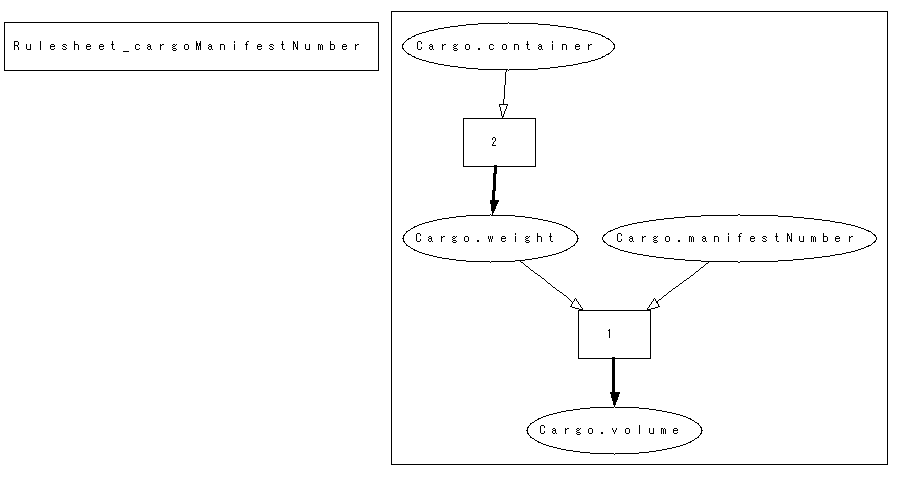

The Logical Dependency Graph is a flowchart-like display of how rules in a Rulesheet execute and which attributes are updated at which point in the execution process.

The Logical Dependency Graph is contained in a GIF file. You open it by selecting Rulesheet > Logical Analysis > Logical Dependency Graph.

The Logical Dependency Graph displays attributes in elliptical shapes and rule column numbers in squares. Arrows link the attributes and squares, denoting the sequence in which the rules execute and in which the attributes acquire their values, either from rule execution or from input data.

Generally, if an attribute does not have an arrow leading to it, it means the value of that attribute is retrieved from input data. An arrow from an attribute to a rule means that the value of the attribute is passed to the rule, which then processes the value in some way. An arrow from a rule to an attribute means that the attribute value is assigned or updated as a result of the rule firing.

So how do you spot dependencies in the Logical Dependency Graph? If rules are in the same logical path or chain—where the chain of arrows eventually lead from one rule to the other—there is dependency. The first rule in a chain is an independent rule. All rules that follow are dependent.

#### Execution Sequence Diagram

The Execution Sequence Diagram displays the order in which rules are executed based on the logic in the Rulesheet.

The Execution Sequence Diagram is contained in a GIF file. You open it by selecting Rulesheet > Logical Analysis > Execution Sequence Diagram.

Dependent rules fire in a sequence that is different from independent rules. So by taking a quick glance at the Execution Sequence Diagram you should be able to tell if there are any dependent rules.

For example, independent rules usually fire from left to right. So column 1 should fire before column 2. However, in this example, the Execution Sequence Diagram shows that column 2 fires before column 1, indicating that there is some dependency.

The best way to use the Execution Sequence Diagram and the Logical Dependency Graph is to first check the diagram for anomalies and then inspect the graph to understand where the dependencies exist.

### Loops

A loop occurs when a rule or a set of mutually dependent rules are triggered once, but execute multiple times.

Consider the following example of looping in a single rule:

* Rule 1: If A < 10, then A = A+1.

Now, consider the example of looping in two rules:

* Rule 1: If A=1, then B=1.
* Rule 2: If B=1, then A=1.

In the first example, if the input data contains the value A=0, the rule executes 10 times. Each time it executes, it adds 1 to the value of A until the value of A is 10.

In the second example, both rules are mutually dependent. Rule 1 triggers Rule 2, which, in turn, triggers Rule 1 again, and so on. This creates a loop where both rules could potentially1 execute infinitely.

Like dependencies, loops can be created intentionally or unintentionally. There may be cases where you want rules to execute in a loop, and there may be cases where a loop is unintentional and you want to address it. Corticon Studio provides tools to help you identify and work with loops.

By default, when Corticon Studio detects a loop, it disables it, preventing rules in the loop from executing more than once. However, you can manually enable looping.

#### How to check for loops in a Rulesheet

You can check if a Rulesheet contains any intentional or unintentional loops by selecting Rulesheet > Logical Analysis > Check for Logical Loops. If there are any loops in the Rulesheet, Corticon Studio identifies and displays the loop in a dialog box.

# Scope and Aliases

Every rule has Scope. Scope determines which entity instances are evaluated and acted upon by a rule. Recall that when you create an association between two entities, a branch gets added under each entity. In this example, an association was created between `Aircraft` and `FlightPlan`. As you can see, a branch for `FlightPlan` appears under `Aircraft` and a branch for `Aircraft` appears under `FlightPlan`.

So both `Aircraft` and `FlightPlan` appear in two places—at a top level and at a branch level.

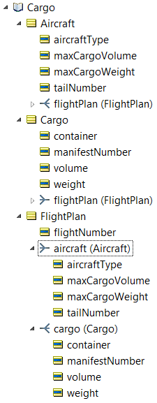

Notice that the attributes of each entity also appear in two places. When you drag and drop one of the attributes, such as `maxCargoWeight`, from the top-level `Aircraft` on to a cell in the Rulesheet, you form the term `Aircraft.maxCargoWeight`. If you use this term in a rule, it applies to ALL instances of the Aircraft entity in the rule’s input or output messages. This rule has global scope.

If you drag and drop the `maxCargoWeight` attribute from the branch level `Aircraft` (under `FlightPlan`), you form the term `FlightPlan.aircraft.maxCargoWeight`. If you use this term in a rule, it applies ONLY to those instances of `Aircraft` that are associated with a `FlightPlan` in the rule’s input or output messages. Aircraft that are not associated with a `FlightPlan` will not be evaluated or acted upon by the rule. This rule has narrow or limited scope.

Whether you use a term from a top level or a branch level entity depends on the scope of the rule that you want to model.

### Example of rule scope

Let’s assume that the transportation company creates a flight plan. It assigns a cargo container and an aircraft to the flight plan and wants to model a rule that throws a Violation message if the cargo weight exceeds the maximum cargo weight of the aircraft assigned to that flight plan.


To achieve this, you define a rule that uses `FlightPlan`’s associations with `Cargo` and with `Aircraft`. You define a condition that compares `Cargo.weight` under `FlightPlan` in the Rule Vocabulary with `Aircraft.maxCargoWeight`, also under `FlightPlan`. When you drag and drop these terms from under `FlightPlan` in the Rule Vocabulary, the terms get represented as shown above.

To test this Rulesheet, you must define input data in the Ruletest in the same hierarchical structure. You must drag and drop FlightPslan from its top level first. Then, you drag and drop Cargo and Aircraft from their branch levels to FlightPlan in the Input pane.

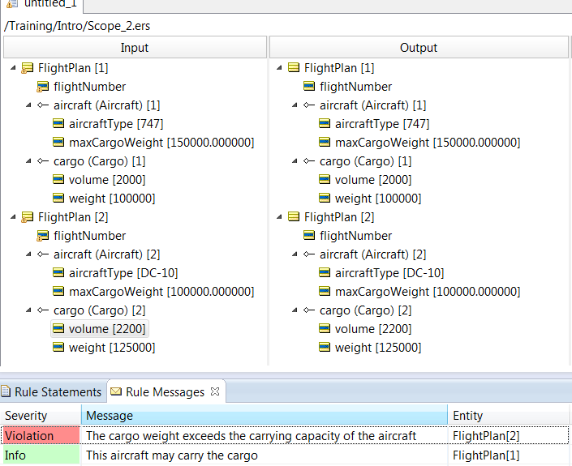

When you run the Ruletest, Corticon evaluates only those Cargo-Aircraft pairings that match the same `FlightPlan`. This means that a `Cargo.weight` will only be compared to an `Aircraft.maxCargoWeight` if both the `Cargo` and the `Aircraft` share the same `FlightPlan`.

If you had used `Aircraft.maxCargoWeight` and `Cargo.weight` from the top level in the Vocabulary tree to define your rule (`Cargo.weight > Aircraft.maxCargoWeight`), Corticon would have compared every Cargo weight with every `Aircraft.maxCargoWeight`, which is not what you want.

When you model rules, it is important to understand what you want your rules to do and define scope accordingly.

### How to choose the right Scope in the Rule Statement

Now that you have some understanding of Scope in rules, let’s look at how to choose the right Scope in a Rule Statement.

As you know, a Rule Statement describes the purpose of a rule and can also be posted as a Rule Message. When you configure it to be posted as a Rule Message, you choose an entity to post it to in the Alias column. What this means is that when the Rule Message is sent or displayed, it is associated with an instance of that entity. For example, if you choose FlightPlan, the rule message contains the entity name (FlightPlan) along with the instance ID (FlightPlan\[1], FlightPlan\[2], etc) as shown in this example:


This helps a client application that is invoking the rule, or a rule modeler who is testing the rule, know which entity instance is responsible for triggering which rule. In some cases, choosing the right entity in the Alias column of a Rule Statement is intuitive. In the FlightPlan.cargo.weight > FlightPlan.aircraft.maxCargoWeight example, you would choose FlightPlan in the Alias column, because you want to know which FlightPlan instance triggered the rule. However, in cases where you are comparing the attributes of two root-level entities, (for example if Cargo.weight > Aircraft.maxCargoWeight), it may be unclear which entity to use in the Alias column. In these cases, you should pick whichever entity you are more interested in from a business point-of-view.

### The Scope Pane

So far, you have modeled simple rules with a small Vocabulary where Scope is easy to identify. However, when you model rules using a complex Vocabulary with many terms and associations, you may find that it is easier to first determine which entities (top level or branch level) and attributes you want to use in your Rulesheet and preselect them for rule modeling.

To do this, you use the Scope pane. To open the Scope pane, switch the Rulesheet to an Advanced View by selecting Rulesheet > Advanced View. You can then drag and drop just those top-level and branch-level terms that you want to use in your Rulesheet from the Rule Vocabulary view. You can then drag and drop terms from the Scope pane to Rulesheet cells.

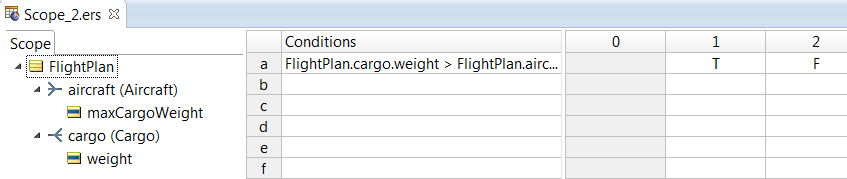

### Aliases

An Alias is a name you define for an entity in the Scope pane. Aliases help reduce the length of terms in Rulesheet cells and make it easier to read the rules. You can define an Alias for a top-level or branch-level entity by double-clicking the node in the Scope pane and entering the Alias name as shown in this example.

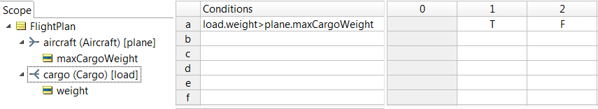

For example, if you want to compare cargo weight and aircraft maxCargoWeight for a FlightPlan, you could define the Alias plane for aircraft under FlightPlan and the Alias load to cargo as shown in this example. The comparison expression in the Rulesheet cell changes from FlightPlan.cargo.weight > FlightPlan.aircraft.maxCargoWeight to load.weight > plane.maxCargoWeight. Although the length of the terms reduce, the Scope of the rule remains the same.

When you define an Alias in the Scope pane, the Alias name replaces the entity name in the list of choices in the Rule Statement’s Alias column. For example, instead of FlightPlan.aircraft, the Alias column will display plane when you click on one of its cells.

In some cases, such as in Collections, Aliases are mandatory.

## Collections

A Collection is a set of instances of the same entity. Each instance is called an element of the Collection. For example, in the input of this Ruletest, there are two elements in the Cargo collection:

.png)

Corticon provides Collection operators that enable you to model rules that apply to a Collection. For example, you can use a Collection operator to find the highest or lowest value, or calculate the total or average value for an attribute, across all elements in a Collection.

Collections have another useful feature. When data is structured in a parent-child hierarchy (for example when one FlightPlan entity—the parent—has an association with many Cargo child entities), Corticon automatically recognizes that each set of children is a separate Collection. In this image, there are two Cargo collections:

.png)

So when you define a rule to calculate the sum of cargo weights for example, the rule will calculate the total weight for each Cargo Collection separately. For FlightPlan \[1] in this image, the rule will calculate a total of 300,000, while for FlightPlan \[2], it will calculate a total of 400,000.

### The role of Aliases and Scope in Collections

Aliases and Scope play a role in Collections too. They determine which entity instances are added to a Collection.

You can define an Alias for a top-level or branch-level entity in the Scope pane of a Rulesheet’s Advanced View. For example, in this image the Cargo branch (the child entity) under FlightPlan (the parent entity) is assigned the Alias load:

.png)

In this case, load represents Cargo instances that are associated with a FlightPlan. If there are multiple FlightPlans, there will be a load Collection (containing a set of Cargo elements) for each FlightPlan. Cargo instances that are not associated with a FlightPlan do not get added to a load Collection.

Any rule that uses the term load applies only to instances of Cargo that are associated with a FlightPlan. Further, if you define a rule, for example to calculate the average value of cargo weight for each FlightPlan (denoted by load.weight instead of FlightPlan.cargo.weight), the rule will calculate an average value for each load Collection.

On the other hand, if Cargo is at the top-level, and an Alias shipment is defined for it, such as in the image below, the shipment Collection will contain all instances of Cargo regardless of association. Any rule that uses the term shipment will apply to all instances of Cargo, irrespective of association.

.png)

Note that you must define an Alias for an entity if you want to use that entity in a Collection-based rule.

### Define rules that apply to Collections

To define rules that apply to Collections, perform the following tasks:

1. Define the Scope of the rules—identify parent-child relationships between entities (if any) that you want to use in the rule and drag and drop those entities and their attributes from the Rule Vocabulary view to the Scope pane in the Rulesheet’s Advanced View. Drag and drop the parent entity first and then the child entity (that appears as a branch under the parent entity). Then, drag and drop attributes. This should create a hierarchy as shown here:

.png)

2. Define Aliases—define an Alias for each entity in the hierarchy for which you want to define a Collection operator-based rule. In this example, we want to calculate the sum of cargo weights for each FlightPlan, so we assign an Alias named load to the Cargo branch under FlightPlan:

.png)

3. Use a Collection operator in a rule—you can see the entire list of Collection operators by expanding the Entity/Association Operators > Collection folder in the Rule Operators view.

.png)

### Example: How to use the sum operator

The sum operator is used at the end of a condition or action expression. It enables you to calculate the total of values of one attribute across all elements of the Collection.

.png)

Observe that in this example, an attribute, totalWeight, has been added to the FlightPlan entity. The purpose of the totalWeight attribute is to hold the value of the sum of all cargo weights assigned to the flight plan.

The rule has just one action expression, FlightPlan.totalWeight=load.weight->sum. Notice that load is the Alias for the cargo association in FlightPlan. The ->sum operator can be dragged and dropped from the Rule Operator view or entered manually.

So, what does this rule do? The rule calculates the sum of the weight attributes for all elements in the load Collection for each FlightPlan and assigns the total to the totalWeight attribute for the FlightPlan.

.png)

As you can see, in the results of the Ruletest, the totalWeight attribute of each FlightPlan displays the sum of the weight attributes of only those Cargo instances associated with it. The top-level Cargo entity instances are not included in any of these calculations.

### Example: How to use the exists operator

The exists operator enables you to check if a certain value for a specified attribute exists within a Collection.

.png)

The syntax for the exists operator is as follows:

```
<AliasName> ->exists(Alias.attribute<ComparisonOperator>value).
```

In this example, there is one rule with a single condition expression. The rule checks if any of the elements in a load Collection holds the value “overweight” for the attribute named container. If the condition expression is true, a Violation rule message is generated.

If the condition expression is false, an Info rule message is generated. Observe that in the Scope pane, load has been defined as the Alias for the Cargo association in FlightPlan. So the condition expression is `load->exists(load.container=‘overweight’).`

When this rule is executed against test data in the Ruletest, Corticon detects the “overweight” value in the first cargo instance and the Violation rule message is generated.

.png)

### Example: How to use the forAll operator

The forAll operator enables you to check if an attribute has a specific value, across all the elements of a Collection.

.png)

The syntax of the forAll operator is:

```
<Alias> -> forAll (Alias.attribute<ComparisonOperator>value).

```

In this example, there is one rule with a single condition expression. The rule checks if the manifest number for each cargo container assigned to a flight plan matches the flight plan number. If the condition expression is true, an Info rule message is generated.

If the condition expression is false, a Violation rule message is generated. Again, in the Scope pane, load has been defined as the Alias for the Cargo association in FlightPlan. Additionally, since FlightPlan will also be used in the expression, plan has been defined as the Alias for FlightPlan.

So the expression is `load->forAll(load.manifestNumber=plan.flightNumber).`

But you will find that this is an invalid expression. Why? The flightNumber is an integer and the manifestNumber is not really a “number”, it is a String. For the purposes of this example, change the flightNumber data type to String.

.png)

In the Input data in the Ruletest, there are two FlightPlan instances. In the first instance, all the associated cargo instances have the same manifest number as the flight number. In the second FlightPlan instance one of the cargo instances has a different manifest number. The rule messages indicate that one Info message and one Violation message is generated.


## Filters and Preconditions

### What is a Filter?

A Filter is an expression that filters out data in an incoming request message. Filters only apply to rules that share the same Scope—only data that survives the Filter is evaluated by those rules. Filters do not apply to rules that have a different Scope. Filters are evaluated before rules in a Rulesheet.&#x20;

You specify a Filter in the Advanced View of a Rulesheet. Here is an example of a simple Filter:

.png)

The Rulesheet solves the problem that was introduced in the beginning of this lesson. The expression in the Conditions area compares the maxCargoWeight of each Aircraft with the sum of cargo weight (denoted by the Alias load) of each FlightPlan. Note the Filters section to the left of the Rulesheet (under the Scope pane). The Filter expression checks if the value of Aircraft.isAircraftReady is True for each instance of Aircraft in input data.&#x20;

Imagine input data containing multiple Aircraft instances and multiple FlightPlan instances, each with a set of Cargo children. Some Aircraft instances have the isAircraftReady attribute set to False and some have it set to True. Only those Aircraft instances that have the attribute to True survive the Filter and are processed by the rule.

### How is a Filter useful?

A Filter is useful in many ways:&#x20;

* It reduces repetition and is easier to maintain. For example, in this Rulesheet we define the expression Cargo.needsRefrigeration=T over several columns:

.png)

If we used a Filter instead, we could define Cargo.needsRefrigeration=T as a Filter expression just once and it would apply to all the rules in this Rulesheet (since in this case the rules share the same Scope).

* You can make a Filter a Precondition. When you do this, if no data survives the Filter, the Rulesheet stops executing, and the flow of execution skips to the next Rulesheet in the Ruleflow. This improves performance because the Decision Service does not spend time processing rules that it does not need to process.
* You can use Filters to partition elements of a Collection into sub-collections. For example, suppose you have a FlightPlan with a Collection of Cargo instances and each Cargo instance has a different type of container. You could create Filters to partition the elements in the FlightPlan’s Cargo Collection by container type and define rules to determine how many instances of each type of container are assigned to the FlightPlan.

### How to define a Filter

To define a Filter, open the Rulesheet’s Advanced View and define the Filter in the Filters pane. You can drag and drop entities and attributes from the Rule Vocabulary to cells in the Filters pane or enter the expression manually. When you define a Filter, the Filter is also displayed in the Scope pane.

.png)

You can define multiple Filters (each in a separate row) that have the same Scope. In this case, input data must survive all the Filters (sequentially top-to-bottom) for any rule with the same Scope to process it.

### How to limit a Filter

Note that when you define a Filter at the branch or ‘child’ level (for example FlightPlan.cargo.weight<100000), the Filter is displayed in two places in the Scope pane—at the parent level (under FlightPlan) as well as under the branch/child level (FlightPlan.cargo).&#x20;

By default, if no child entity survives the Filter, the parent entity is filtered out as well. Any rule that processes an attribute of the parent entity or any other child branches of the parent entity will not fire since the parent entity has been filtered out.&#x20;

This type of behavior is called a Full Filter. A Full Filter is desirable in most cases. However, in some situations you may want to limit the Filter so that rules that process other branches of the parent entity or attributes of the parent entity will still fire.&#x20;

To limit the Filter, expand the Filters node under the parent entity (in this case FlightPlan) in the Scope pane, right-click the Filter and select Disable.

.png)


This disables the Filter at the parent level (it gets greyed out as shown here) but still keeps it enabled at the child level.&#x20;

.png)

Because the Filter is enabled at the child level for the load entity, any rule that uses the load entity will only process those elements of load that survive the Filter. Any other rules that process attributes of the parent entity (FlightPlan) or other branches of the parent entity (plane, pilot) will ignore the Filter.

### How to use Filters to partition Collections

As you learned earlier, you can use Filters to partition Collections of child entities. To do this, you:&#x20;

1. Drag and drop the child entity’s branch to the Scope pane multiple times&#x20;
2. Assign an Alias for each branch to represent each Collection&#x20;
3. Create a Filter for each Alias&#x20;

For example, if there are two types of containers—STANDARD and LARGE—you can use Filters to count how many of each type of container is assigned to a FlightPlan:

.png)

As you can see, the Cargo branch of FlightPlan has been added to FlightPlan two times. Each branch has been assigned a different Alias (stan and large) to represent the two types of sub-collections we want (STANDARD and LARGE). Finally, each Filter defines which instances of Cargo get added to which sub-collection. Cargo instances that have the value STANDARD (for the container attribute) get added to stan, as defined by the expression stan.container=‘STANDARD’. Similarly Cargo instances that have the value LARGE get added to large.

Once you define Filters to create sub-collections, you can use the Aliases in rules to compare sub-collections or perform Collection-based operations. For example, you could create a rule to check which type of container is greater in number using the ->size operator as shown here:

.png)

.png)

### Preconditions

You can make a Filter a Precondition. If no data survives the Precondition Filter, none of the rules will execute, regardless of whether the Scope of the rules match the Scope of the Filter. This is useful when the Rulesheet is part of a Ruleflow, and you want the Rulesheet to stop executing if no data survives the Filter, and pass the data to the next Rulesheet. This improves performance since the Decision Service does not spend time processing rules that it does not need to process.&#x20;

Let’s take an example. Suppose that we want to identify Cargo instances that have high priority so that we can ship them the same day. To enable this, we add an attribute named priorityLevel to the Cargo entity and an attribute named departureDate to the FlightPlan entity. Next, we create a Rulesheet with the following components:

* A Filter containing the expression: Cargo.priorityLevel=1&#x20;
* An action-only rule that uses the .new operator to create a new FlightPlan entity: FlightPlan.new\[flightNumber=11,departureDate=today]&#x20;

Note that if there are no containers with a priorityLevel of 1, we do not want the rule to fire. However, since this is an action-only rule, and it does not have the same Scope as the Filter, it will still fire. To get the result we want, we can make the Filter a Precondition by right-clicking the Filter and selecting Precondition:

.png)

The Filter icon changes as shown below, indicating that the Filter is a Precondition:

.png)

Here is the complete Rulesheet:

.png)

Now let’s test the Rulesheet with input data containing a Cargo instance that survives the Filter. As you can see here, a new FlightPlan is created:

.png)

Let’s test this Rulesheet again with data where no Cargo instances survive the Filter:

.png)

As you can see, no FlightPlan is created.
