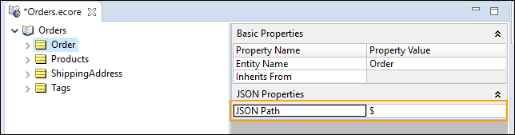
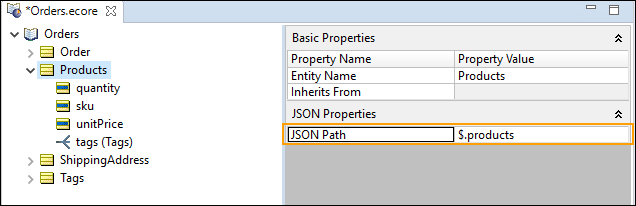
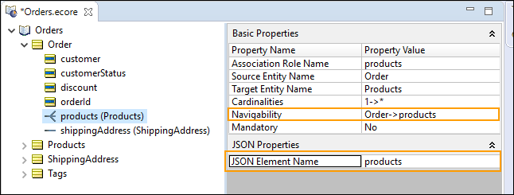
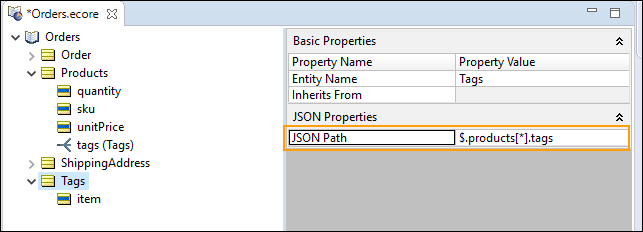
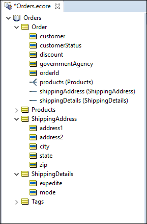
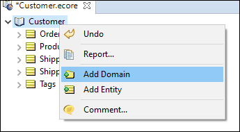

A **Rule Vocabulary** enables you to define all the business terms that you require in your rules. 
 
For example, a transport company may have a rule that determines how much cargo each type of vehicle can carry. There are two key business terms used in this rule—cargo and vehicle. You could define these terms as entities in your Vocabulary.
 
A Vocabulary is similar to a data model such as a UML model or an ER model. The terms for the Vocabulary could come from database tables, forms used in business operations, policy and procedure documents, etc.
 
When you build a Vocabulary, you also define relationships between business terms. For example, a single vehicle can carry many cargo containers, implying a one-to-many relationship. You would define this as an association in your Vocabulary.

## Creating a Vocabulary

Corticon makes it easy to start your rule projects by letting you generate the Vocabulary directly from the JSON that your rules will process. This technique accelerates development, so that you can quickly get started writing rules, and ensures your vocabulary matches the JSON payloads that will be passed as input to your rules when deployed.

To generate a vocabulary, select a JSON file that is representative of the range of objects and fields (entities and attributes) that could be passed to your rules when deployed.

You need not be concerned if your JSON data model changes. Corticon lets you easily update your vocabulary by reimporting JSON, or by editing your Vocabulary by hand.

### Create a Vocabulary from a JSON schema
Suppose your company belongs to an industry consortium that has defined a standard format for JSON messages for communication between suppliers and customers. The consortium may opt to define a JSON schema for the JSON. JSON schema providers a greater ability to define valid content for JSON payloads.

The use of JSON schema is in the early days of being adopted. JSON Schema is primarily used when different organizations need a formal definition of an agreed upon data model. Using JSON schema has advantages for vocabulary generation such as options for defining enumerated values and for transcribing comments into the Vocabulary. Be careful: Some schemas are very large and have more than you need. You may want to cut the schema down to just what you need before generating the vocabulary. 

Suppose you are writing rules for a B2B e-commerce application that will determine what, if any, discounts should be applied to an order. An order contains contact information about the customer, their partnership status ('elite' or 'standard') and the items in the order. Your rules will examine this information to determine a discount rate for the order in line with the promotions being offered by your company. For example, 'elite' customers might get 15% off on orders over $10,000.

Working with IT, you've been supplied this sample JSON file representing an order. JSON in this format is used by other components of your e-commerce application:

```
{
    "orderId": 494748,
    "customer": "Acme Industries",
    "customerStatus": "elite",
     "shippingAddress": {
        "address1": "1234 Industrial Lane",
        "address2": null,
        "city": "Boston",
        "state": "MA",
        "zip": "01234"
    },
    "products": [
        {
            "sku": "XYZ-BB-43",
            "unitPrice": 2300.00,
            "quantity": 2,
            "tags": [
                "industrial",
                "compressor"
            ]
        }
    ],
    "discount": 0.0
}			
```
### To populate a Vocabulary from a JSON payload:

1. Copy the preceding JSON and then save in a temporary file.
2. In Corticon Studio, create a new Rule Project named OnlineRetail.
3. In the project, create a Vocabulary named Orders.
4. Click in the Vocabulary edit window, and then select Vocabulary > Populate Vocabulary from JSON.
5. Choose the temporary file with the JSON you saved, and then click Open.

The Vocabulary that the JSON generates is the following:


Let's take a closer look at the Vocabulary:

- Root entity—The JSON source has an object definition at root, indicated by the JSON starting with initial brace. You know this root entity is an order. Corticon does not know that, so it named the top-level entity Root. After vocabulary generation completes you can refactor the root entity name to Order:



- Attributes—Each attribute takes the JSON Element Name that was in the source JSON. The root entity has five attributes that are added as attributes of Root. You can manually revise the data type as appropriate. This is the incoming payload identifier that will map to its Vocabulary attribute name:

- Non-root entities—Other entities take the name in the source JSON, and specify their JSON Path as relative to the root:

- Associations: Corticon added the Products entity, and then added an association from Root (Order) to products:

- Scalar arrays—A scalar array is handled as an association from the entity with its own identifying Entity. The JSON Array's relationship shows that products is relative to root ($) and one or more tags are related to products:
- 

### Update a vocabulary from a JSON payload
Suppose your Sales department wants to enhance the discount program to provide an additional discount to government agencies and whether an order is marked for expedited handling. In support of this IT has provided an updated sample JSON the includes the new information.

An update generates new entities, attributes, and associations. The existing entities, attributes, and associations are not revised by regenerating over the existing Vocabulary. If you want one element to be regenerated, delete it before you perform the update. You could even delete the vocabulary entirely, and then start fresh. The original sample payload adds a requirement for Billing Address to the sampleCustomer Vocabulary.

```
{
    "orderId": 494748,
    "customer": "Acme Industries",
    "customerStatus": "elite",
    "governmentAgency": false,

    "shippingAddress": {
        "address1": "1234 Industrial Lane",
        "address2": null,
        "city": "Boston",
        "state": "MA",
        "zip": "01234"
    },
    "shippingDetails": {
        "expedite": true,
        "mode": "ground"
    },

    "products": [
        {
            "sku": "XYZ-BB-43",
            "unitPrice": 2300.00,
            "quantity": 2,
            "tags": [
                "industrial",
                "compressor"
            ]
        }
    ],
    "discount": 0.0
}				
```
When you regenerate your vocabulary from this JSON, it will add new entities, attributes and associations to your vocabulary for the new items in the JSON. The Vocabulary shows the added entity, attributes, and association:


### Integrating multiple sources into a Vocabulary

To build a single vocabulary that integrates multiple data feeds, it is convenient to import additional sources into separate vocabulary domains. Corticon enables you to import into an added domain without impacting the rest of the Vocabulary.

Consider a variation on the customer info so that it identifies a partner:

```
{
"orderId": 494749,
"partner": "Acme Partners",
"partnerStatus": "elite",
"shippingAddress": {
	"address1": "2000 Industrial Ave",
	"address2": null,
	"city": "Boston",
	"state": "MA",
	"zip": "01234"
},
"shippingDetails": {
	"expedite": true,
	"mode": "ground"
}
}
"discount": 25.0
}				
```
In the Vocabulary file, right-click at the root and then choose Add Domain:


Click on the new domain to refactor the name to Partners. 


Right-click on the Partners domain and then choose Populate Domain From JSON:


Choose the file where the preceding listing was saved, and click Open.

The data is added to the Vocabulary.

Note that a reference to an attribute in an added domain requires the domain as a qualifier of the attribute when used in rules. In this example, the regular ShippingAddress.address1 in a Rulesheet would be differentiated from Partners.ShippingAddress.address1.

