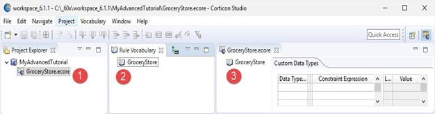

# The Rule Vocabulary

A **Rule Vocabulary** enables you to define all the business terms that you require in your rules. 
 
For example, a transport company may have a rule that determines how much cargo each type of vehicle can carry. There are two key business terms used in this rule—cargo and vehicle. You could define these terms as entities in your Vocabulary.
 
A Vocabulary is similar to a data model such as a UML model or an ER model. The terms for the Vocabulary could come from database tables, forms used in business operations, policy and procedure documents, etc.
 
When you build a Vocabulary, you also define relationships between business terms. For example, a single vehicle can carry many cargo containers, implying a one-to-many relationship. You would define this as an association in your Vocabulary.

## Creating a Vocabulary

Corticon makes it easy to start your rule projects by letting you generate the Vocabulary directly from the JSON that your rules will process. This technique accelerates development, so that you can quickly get started writing rules, and ensures your vocabulary matches the JSON payloads that will be passed as input to your rules when deployed.

To generate a vocabulary, select a JSON file that is representative of the range of objects and fields (entities and attributes) that could be passed to your rules when deployed.

You need not be concerned if your JSON data model changes. Corticon lets you easily update your vocabulary by reimporting JSON, or by editing your Vocabulary by hand.

### Create a Vocabulary from a JSON schema
Suppose your company belongs to an industry consortium that has defined a standard format for JSON messages for communication between suppliers and customers. The consortium may opt to define a JSON schema for the JSON. JSON schema providers a greater ability to define valid content for JSON payloads.

The use of JSON schema is in the early days of being adopted. JSON Schema is primarily used when different organizations need a formal definition of an agreed upon data model. Using JSON schema has advantages for vocabulary generation such as options for defining enumerated values and for transcribing comments into the Vocabulary. Be careful: Some schemas are very large and have more than you need. You may want to cut the schema down to just what you need before generating the vocabulary. 

Suppose you are writing rules for a B2B e-commerce application that will determine what, if any, discounts should be applied to an order. An order contains contact information about the customer, their partnership status ('elite' or 'standard') and the items in the order. Your rules will examine this information to determine a discount rate for the order in line with the promotions being offered by your company. For example, 'elite' customers might get 15% off on orders over $10,000.

Working with IT, you've been supplied this sample JSON file representing an order. JSON in this format is used by other components of your e-commerce application:

```
{
    "orderId": 494748,
    "customer": "Acme Industries",
    "customerStatus": "elite",
     "shippingAddress": {
        "address1": "1234 Industrial Lane",
        "address2": null,
        "city": "Boston",
        "state": "MA",
        "zip": "01234"
    },
    "products": [
        {
            "sku": "XYZ-BB-43",
            "unitPrice": 2300.00,
            "quantity": 2,
            "tags": [
                "industrial",
                "compressor"
            ]
        }
    ],
    "discount": 0.0
}			
```
### To populate a Vocabulary from a JSON payload:

1. Copy the preceding JSON and then save in a temporary file.
2. In Corticon Studio, create a new Rule Project named OnlineRetail.
3. In the project, create a Vocabulary named Orders.
4. Click in the Vocabulary edit window, and then select Vocabulary Populate Vocabulary from JSON.
5. Choose the temporary file with the JSON you saved, and then click Open.

The Vocabulary that the JSON generates is the following:


Let's take a closer look at the Vocabulary:

- Root entity—The JSON source has an object definition at root, indicated by the JSON starting with initial brace. You know this root entity is an order. Corticon does not know that, so it named the top-level entity Root. After vocabulary generation completes you can refactor the root entity name to Order:


- Attributes—Each attribute takes the JSON Element Name that was in the source JSON. The root entity has five attributes that are added as attributes of Root. You can manually revise the data type as appropriate. This is the incoming payload identifier that will map to its Vocabulary attribute name:

- Non-root entities—Other entities take the name in the source JSON, and specify their JSON Path as relative to the root:

- Associations: Corticon added the Products entity, and then added an association from Root (Order) to products:

- Scalar arrays—A scalar array is handled as an association from the entity with its own identifying Entity. The JSON Array's relationship shows that products is relative to root ($) and one or more tags are related to products:
- 

### Update a vocabulary from a JSON payload
Suppose your Sales department wants to enhance the discount program to provide an additional discount to government agencies and whether an order is marked for expedited handling. In support of this IT has provided an updated sample JSON the includes the new information.

An update generates new entities, attributes, and associations. The existing entities, attributes, and associations are not revised by regenerating over the existing Vocabulary. If you want one element to be regenerated, delete it before you perform the update. You could even delete the vocabulary entirely, and then start fresh. The original sample payload adds a requirement for Billing Address to the sampleCustomer Vocabulary.

```
{
    "orderId": 494748,
    "customer": "Acme Industries",
    "customerStatus": "elite",
    "governmentAgency": false,

    "shippingAddress": {
        "address1": "1234 Industrial Lane",
        "address2": null,
        "city": "Boston",
        "state": "MA",
        "zip": "01234"
    },
    "shippingDetails": {
        "expedite": true,
        "mode": "ground"
    },

    "products": [
        {
            "sku": "XYZ-BB-43",
            "unitPrice": 2300.00,
            "quantity": 2,
            "tags": [
                "industrial",
                "compressor"
            ]
        }
    ],
    "discount": 0.0
}				
```
When you regenerate your vocabulary from this JSON, it will add new entities, attributes and associations to your vocabulary for the new items in the JSON. The Vocabulary shows the added entity, attributes, and association:


### Integrating multiple sources into a Vocabulary

To build a single vocabulary that integrates multiple data feeds, it is convenient to import additional sources into separate vocabulary domains. Corticon enables you to import into an added domain without impacting the rest of the Vocabulary.

Consider a variation on the customer info so that it identifies a partner:

```
{
"orderId": 494749,
"partner": "Acme Partners",
"partnerStatus": "elite",
"shippingAddress": {
	"address1": "2000 Industrial Ave",
	"address2": null,
	"city": "Boston",
	"state": "MA",
	"zip": "01234"
},
"shippingDetails": {
	"expedite": true,
	"mode": "ground"
}
}
"discount": 25.0
}				
```
In the Vocabulary file, right-click at the root and then choose Add Domain:


Click on the new domain to refactor the name to Partners. 


Right-click on the Partners domain and then choose Populate Domain From JSON:


Choose the file where the preceding listing was saved, and click Open.

The data is added to the Vocabulary.

Note that a reference to an attribute in an added domain requires the domain as a qualifier of the attribute when used in rules. In this example, the regular ShippingAddress.address1 in a Rulesheet would be differentiated from Partners.ShippingAddress.address1.


## Designing a Vocabulary by Hand

To create a new Vocabulary:

1.	Do one of the following:
    -	Select File New Rule Vocabulary from the Corticon Studio menubar
    -	Click the down arrow to the right of the New icon
    -	Right-click in the Project Explorer to open its menu, and then choose New Rule Vocabulary.
2.	Select the parent Rule Project for the new Vocabulary by highlighting the Example_Project folder we just created.
3.	Enter a name for the new Vocabulary in the File name entry area. It is not necessary to type the file extension .ecore (we used Cargo here).
4.	Click Finish to create your new Vocabulary.
The Vocabulary is now displayed in the Project Explorer window (1), in the new Rule Vocabulary window (2), and as the open file and active tab in the GroceryStore.ecore window (3) in the following illustration.



## Populate a Vocabulary from a Datasource

Often you have data sources that you want to use as the basis for your rule modeling that might have many tables, each with many columns. You could transcribe each data source's schema to create a Vocabulary, yet the ability to populate the Vocabulary quickly from the schema would expedite the process dramatically.

When you use this built-in Vocabulary generation utility, Corticon sets up the name patterns and defines the data types and associations as best it can. It is important that you review the Vocabulary against the source schema, to validate that the results are correct.

The following are the relationships between relational Datasources and Corticon Vocabulary elements are:


| Relational database | Corticon Vocabulary |
| --- | --- |
| Schema | Vocabulary |
| Table | Vocabulary: Entity |
| Table Column or Field | Vocabulary: Attribute |
| Relationship between Tables | Vocabulary: Association |

### Step 1: How Datasources are transformed into a Corticon Vocabulary

After you connect to a Datasource and import its metadata, you can constrain the tables and attributes that will be evaluated. Then, the internal algorithm makes its best effort to populate the Vocabulary.

Assuming that you are creating a new Vocabulary, these are the steps it takes:

1.  For each selected Table in the Datasource, create a new Entity in the Vocabulary.
2.  For each Column in the Table:
    1.  Create a new Attribute in the Entity.
    2.  Determine the best Corticon data type for the Attribute by referring to the column's data type information.
    3.  If the column is part of the Table's primary key, then mark the Attribute as part of the Entity identity.
3.  After all Tables and Columns are processed, Associations are created for each foreign key for each table (if the source and target tables are both mapped in the Datasource).

The creation process tries to be complete and accurate, but it has limited abilities:

-   Columns that are referenced by foreign keys are not added as Attributes.
-   Tables that do not have any valid columns are not created (such as, Association middle tables or Sequence tables).
-   The data type for an attribute is evaluated in this order: Datetime, Time, Date, Decimal, Integer, String, and Boolean. Some Corticon data types might not get picked for attributes because of an overload of possible mappings (such as, Date and Time could always be created as Datetime). Note that these decisions are derived from data when data is in a REST source that has no schema.

### Step 2: The Vocabulary generation process for RDBMS sources

Relational databases have well-structured schemas that declare every element's data type. The following steps in Corticon Studio populate a new Vocabulary from a relational database Datasource. For an example, use the Patient/Treatment schema that was created in SQL Server from SQL statements in the Data Integration's **ADC Connectivity** sample.

To generate a Vocabulary from a relational data source:

1.  In Corticon Studio, create a new Rules Project named **GenMed**.
2.  In the new project, create a Vocabulary named **GenMed**.
3.  Open the Vocabulary in its editor, and then select the menu command **Vocabulary > Add Datasource > Add ADC Datasource**.
4.  Define the Datasource name as **Patient Data**. Connect to SQL Server database **PatientRecords**. Enter credentials, and the click **CONNECTION Test**:
    
    
    
    Note: You might want to add a **Schema Filter** value, such as `dbo`, to constrain the results of the next step.
    
5.  Click **METADATA Import**, and then choose the option to choose the tables you want to use. For this example, choose just the two `dbo` tables, as shown:
    
    
    
    and click **Finish**.
6.  Select **Vocabulary > Populate Vocabulary From Datasource**:
    
    
    
7.  Choose the **Patient Data** Datasource. If there were several Datasources defined, choose them one at a time for this process. In this example, there is only one. Click **Next**.
8.  A wizard opens to let you review the Datasource prior to creating the Vocabulary elements, where you can select the Tables and Columns that create Entities and Attributes. In the following image, the tree was expanded:
    
    
    
9.  Click **Finish**. The Vocabulary is generated, as shown:
    
    
    

[](https://docs.progress.com/bundle/corticon-rule-modeling/page/Step-1-How-Datasources-are-transformed-into-a-Corticon-Vocabulary.html)

### Step 3: The Vocabulary generation process from REST sources
REST sources are usually not as clearly structured as relational databases. Some provide a schema, but generally they do not. REST sources can conform to a relational database schema when Corticon uses the Progress® DataDirect® Autonomous Rest Connector to access REST sources. The REST connector maps the JSON in a REST source to a relational database schema, and then translates SQL statements to REST API requests. These steps in Corticon Studio populate a new Vocabulary from the REST Datasource used in the REST connectivity sample from the Data Integration guide. The REST source has no schema; its data looks this:

  
  

To generate a Vocabulary from a REST data source:

1.  In Corticon Studio, create a new Rule Project named **GenRates**.
2.  In the new project, create a Vocabulary named **GenRates**.
3.  Open the Vocabulary in its editor, and then select **Vocabulary > Add Datasource > Add REST Datasource**.
4.  Define the Datasource connection for the URL `https://bj36i9ki66.execute-api.us-east-2.amazonaws.com/prod/ReimbursementRate?procedureCode=B5120ZZ` as shown, and then click **CONNECTION Test**:
    
    
    
5.  Click **SCHEMA Discover**. If your REST source has a schema, or is one that you exported in an earlier processing of this source you could import it now. For this source, you need to let the Progress® DataDirect® Autonomous Rest Connector map the JSON in the REST source to a relational database schema, and then translate SQL statements to REST API requests.
6.  Select **Vocabulary > Populate Vocabulary From Datasource**
    
    
    
7.  Choose the **REST Service** Datasource. If there were several Datasources defined, choose them one at a time for this process. In this example, there is only one, **REST Service**. Click **Next**.
8.  A wizard opens to let you review the Datasource prior to creating the Vocabulary elements, where you can select the Tables and Columns to create as Entities and Attributes. Here, the tree was expanded for `REST_DATA`, the primary table that was unnamed so it was given this default name. You can see links between tables to all the other tables at the bottom of the table.
    
    
    
9.  Click **Finish**. The Vocabulary is generated, as shown:
    
    
    
    The Primary Key in `RATES` is `POSITION`, a standard that REST connector uses to ensure keys are unique, plus the `REST_DATA_PROCEDURECODE`, the default name of the primary entity. The Primary Key in the `REST_DATA` entity is the single primary key, `PROCEDURECODE`

Here is an association:


[](https://docs.progress.com/bundle/corticon-rule-modeling/page/Step-2-The-Vocabulary-generation-process-for-RDBMS-sources.html)

### Step 4: Verify and update the generated Vocabulary

#### Produce a Vocabulary Report

The import of Datasource metadata to build a Vocabulary is a processed through a best-effort algorithm. You should produce a Vocabulary report to review the entity names, attribute names and their data types, and the implied associations.

#### Adding and deleting

You can delete any entity (which deletes all its attributes) and any attributes and associations. Be careful not to delete primary keys. The effect of deletions in the Vocabulary are local. The deletions do not affect the Datasource. You can add attributes, and because the metadata you imported was not deleted, you can re-add a deleted attribute and bind it to the column in the Datasource.

Doing updates from a Datasource is not a synching operation. There is no provision for removing metadata that is no longer in the Datasource.

#### Refactoring names

You can rename any entity and attribute even if it is a just a case change. For example, you can refactor `dob` with `DOB`. It is important that you _refactor_, not _rename_, so that other instances of the name in the Vocabulary such as associations are also updated.

If you repopulate the Vocabulary from the Datasource, then the name you entered is retained while it is still logically the Datasource column name.

Note: **MS Dynamics as a Datasource**: Some table names in Dynamics might map to an unexpected name. For example, a Case table might become an Incident entity by default on the initial import.

#### Data types

The algorithm in the import makes a best effort to map the Datasource's data type to a corresponding Corticon data type. The data type for an attribute is evaluated in this order: Datetime, Time, Date, Decimal, Integer, String, and Boolean. Some Corticon data types might not get picked for attributes because of an overload of possible mappings (such as, Date and Time could always be created as Datetime). Note that these decisions are derived from data when data is in a REST source that does not have a schema. After import, you can revise the data type, for example when you have custom data types that apply constraints, or date of birth imports as Datetime when your rules want just Date, or when `"flight_number":55` is imported as an integer data type when you want it as a String,

#### Mandatory

Whether an attribute is mandatory is set by you. It is not changed on a re-import.

#### Associations

The metadata from the Datasource often provides correct associations. When you use multiple Datasources, you need to create the associations between entities. In all cases, review your associations.

#### Transients

You can add transients. If you change an imported attribute to a transient, then its binding to its Datasource column is dropped.

#### Foreign keys

When if both the source and target table are mapped in the Datasource, then an association is created for each foreign key for each table.

#### Domains

You might need multiple domains. If you use REST Datasources, then you need to rename the existing domains before importing a new one.

[](https://docs.progress.com/bundle/corticon-rule-modeling/page/Step-3-The-Vocabulary-generation-process-from-REST-sources.html)