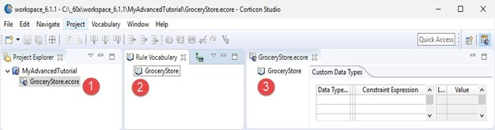
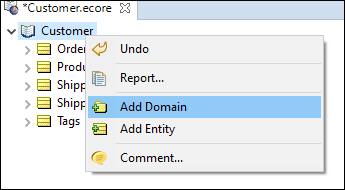

# The Rule Vocabulary

A **Rule Vocabulary** enables you to define all the business terms that you require in your rules. 
 
For example, a transport company may have a rule that determines how much cargo each type of vehicle can carry. There are two key business terms used in this rule—cargo and vehicle. You could define these terms as entities in your Vocabulary.
 
A Vocabulary is similar to a data model such as a UML model or an ER model. The terms for the Vocabulary could come from database tables, forms used in business operations, policy and procedure documents, etc.
 
When you build a Vocabulary, you also define relationships between business terms. For example, a single vehicle can carry many cargo containers, implying a one-to-many relationship. You would define this as an association in your Vocabulary.

The proper expression and execution of rules in Corticon rules is dependent on the type of data involved. Each attribute in the Corticon Vocabulary has a data type, meaning that it has restrictions on the type of data it can contain. Corticon standard data types are as follows:

| Data Type | Description |
| --- | --- |
| String | Any combination of alphanumeric characters, of any length, |
| Integer | A whole number, including zero and negative numbers, to the maximum values for a 64-bit long signed integer (-9,223,372,036,854,775,808 to 9,223,372,036,854,775,807) |
| Decimal | A number containing a decimal point, including zero and negative numbers to the limits of double precision (see [IEEE\_754](https://en.wikipedia.org/wiki/IEEE_754) for details.) |
| Boolean | Values are `true` and `false`. `T` and `F` can also be used. |
| DateTime | Values must be entered for both date and time. |
| Date | A value with only date information. No Time information is allowed. |
| Time | Value with only time information. No Date information is allowed. |

## Creating a Vocabulary

Corticon makes it easy to start your rule projects by letting you generate the Vocabulary directly from the JSON that your rules will process. This technique accelerates development, so that you can quickly get started writing rules, and ensures your vocabulary matches the JSON payloads that will be passed as input to your rules when deployed.

To generate a vocabulary, select a JSON file that is representative of the range of objects and fields (entities and attributes) that could be passed to your rules when deployed.

You need not be concerned if your JSON data model changes. Corticon lets you easily update your vocabulary by reimporting JSON, or by editing your Vocabulary by hand.

### Designing a Vocabulary by Hand

To create a new Vocabulary:

1.	Do one of the following:
    -	Select File New Rule Vocabulary from the Corticon Studio menubar
    -	Click the down arrow to the right of the New icon
    -	Right-click in the Project Explorer to open its menu, and then choose New Rule Vocabulary.
2.	Select the parent Rule Project for the new Vocabulary by highlighting the Example_Project folder we just created.
3.	Enter a name for the new Vocabulary in the File name entry area. It is not necessary to type the file extension .ecore (we used Cargo here).
4.	Click Finish to create your new Vocabulary.
The Vocabulary is now displayed in the Project Explorer window (1), in the new Rule Vocabulary window (2), and as the open file and active tab in the GroceryStore.ecore window (3) in the following illustration.



# Custom Data Types

Corticon uses seven basic data types: Boolean, Decimal, Integer, String, DateTime, Date, and Time. An attribute must use one of these types. You also have the option of creating custom data types that “extend” any one of these basic seven.

You define and maintain Custom Data Types in a Vocabulary by selecting the Vocabulary name in the tree view.

## Data Type Name

When defining a custom data type, you must give it a name with no blank spaces. The name must comply with standard entity naming conventions (see the Quick Reference Guide for details), and must not overlap (match) any of the base data types, any other custom data type names, or the names of any Vocabulary entities.

## Base Data Type

The selection in this field determines which base data type the custom data type extends.

You already used this feature in the custom data type `containerType`, a `String`, in the [Basic Rule Modeling Tutorial](https://docs.progress.com/bundle/corticon-rule-modeling/page/../../basic-corticon-tutorial/page/Tutorial-Basic-Rule-Modeling-in-Corticon-Studio.html) . The following figure lists its labels and values.

Figure 1. Vocabulary Editor Showing the Custom Data Type containerType


## Enumeration or Constraint Expression?

Enumeration—When the Enumeration for a Custom Data Type is set to `Yes`, as shown in the preceding figure, the Constraint Expression field is disabled, and the Label and Value columns are enabled.

Constraint Expression—When the Enumeration for a Custom Data Type is set to `No`, the Constraint Expression field is enabled, and the Label and Value columns are disabled.

The following sections explore each of these features.

### Constraint Expressions

When you want to prompt Rulesheet and Ruletest designers to use a specific range of values for an attribute, a constraint expression will validate entries when the associated Ruletest runs.

Constraint expressions are optional for non-enumerated Custom Data Types, but if none are used, then the Custom Data Type probably is not necessary because it reduces to a base attribute with a custom name.

All **Constraint Expressions** must be `Boolean` expressions: they must return or resolve to a Boolean value of **`true`** or `false`. The supported syntax is the same as Filter expressions with the following rules and exceptions:

-   Use `value` to represent the Custom Data Type value.
-   Logical connectors such as `and` and `or` are supported.
-   Parentheses can be used to form more complex expressions
-   The expression can include references to Base and Extended Operators which are compatible with the Base Data Type chosen.
-   No Collection operators can be referenced in the expression.
-   There should be **no** references to `null`. This is because `null` represents a lack of value and is not a real value. The Constraint Expression is intended to constrain the value space of the data type, and expressions such as attribute `expression <> null` do not belong in it. An attribute that must not have a null value can be designated by selecting `Yes` in its **Mandatory** property value.

The following are typical Constraint Expressions:

| **Constraint Expression** | **Meaning** |
| --- | --- |
| value > 5 | Integer values greater than 5 |
| value >= 10.2 | Decimal values greater than or equal to 10.2 |
| value in (1.1..9.9\] | Decimal values between 1.1 (exclusive) and 9.9 (inclusive) |
| value in \[‘1/1/2014 12:30:00 PM’..’1/2/2019 11:00:00 AM’) | DateTime values between ‘1/1/2014 12:30:00 PM’ (inclusive) and ‘1/2/2019 11:00:00 AM’ (exclusive) |
| value in \[‘1:00:00 PM’..’2:00:00 PM’\] | Time values between ‘1:00:00 PM’ (inclusive) and ‘2:00:00 PM’ (inclusive) |
| value.size >= 6 and (value.indexOf(1) > 0 or value.indexOf(2) > 0) | String values of minimum 6 characters in length that contain at least a 1 or 2 |

### How to use non-enumerated Custom Data Types in Rulesheets and Ruletests

Non-enumerated custom data types use **Constraint Expressions** and do not cause Rulesheet drop-down lists to become populated with custom sets. Also, manually entering a cell value that violates the custom data type's **Constraint Expression** is **not** prohibited in the Rulesheet. For example, in the following figure, `weightRange` is defined as a non-enumerated custom data type with **Base Data Type** of `Decimal`.

Figure 1. Non-enumerated Custom Data Types


Then, after assigning it to the Vocabulary attribute `Cargo.weight`, it is used in a Rulesheet Condition row as shown:

Figure 2. Using Custom Data Types in a Rulesheet


Notice in the preceding figure that the `300000` entry violates the **Constraint Expression** of the custom data type assigned to `Cargo.weight`,  but _does not turn red or otherwise indicate a problem_. The indication comes when data is entered for the attribute in a Ruletest, as shown:

Figure 3. Violating a Custom Data Type's Constraint Expression


Notice that the small yellow warning icon  indicates a problem in the attribute, entity, and both Ruletest tabs. Such an error is hard to miss.  Also, a Warning message will appear in the Problems tab (if open and visible) as shown. If the **Problems** tab is closed, you can display it by selecting Window > Show View > Problems from the Studio menubar.

Figure 4. Violating the Constraint Expression of a Custom Data Type


A Warning does not prevent you from running the Ruletest. However, an Error, indicated by a small red icon , will prevent the Ruletest execution. You must fix any errors before testing.

[](https://docs.progress.com/bundle/corticon-rule-modeling/page/Constraint-Expressions.html)

### Enumerations
Enumerations are lists of strictly typed unique values that are the valid values for each attribute that is assigned the custom data type name as its data type. These lists also prompt Rulesheet and Ruletest designers to use a specific list of values. Enumerated lists, often referred to as _enums_, can be maintained directly in the Vocabulary, or retrieved and updated from a data source.

Each item list can be partnered with a unique _label_ that you select in Rulesheets and Ruletests.

Before you start setting up and using enumerations, you should get acquainted with labels and values.

Note: It is important that you determine whether you want to use labels, because changing a set of enumerations later to add or remove the labels data will affect any Rulesheets and Ruletests that use that custom data type's enumerations as you can observe in this topic.

At the Vocabulary root, you created a String enumeration with only values. The base data type can be any Corticon data type except Boolean. Every line requires a unique entry of its type, and the list must have no blank lines from the top down to the last line.

The following examples are String values. They can contain spaces and most other characters. It needs to be set off in plain single quotation marks. If you enter or paste text with the delimiters, they are added for you. Like this:

  
  

If you want to use labels, then the label is always a String of any alphanumeric characters but cannot contain spaces. Each must be unique and must have a corresponding value. Even when you use labels, the values must be unique.

  
  

Set `Glove.color` to use the `colorUnlabeled` data type:

  
  

Set `Ball.color` to use the `colorLabeled` data type:

  
  

When you create a Rulesheet, the list offered at A1 contains the label (`Ball.color = red`) , while the list offered at B1 contains the value in qoutes (`Glove.color='red'`).

  
  

You add Rule Statements so that you can see how the labeled and unlabeled items are handled.

In a simple Ruletest, add some size tests to see what happens. As shown, the labels and values in the resulting **Output** are both unquoted. The **Rule Messages** tab displays the value when the label was in use and the value of the value-only enumeration.

  
  

Entry of test values in the Ruletest list the label+value's label:

  
  

The value-only list has quoted values:

  
  

Both are reconciled to unquoted values in the displayed **Input** and **Output** columns:

  
  

Note: It is important that you determine in each custom data type whether you want to use labels. Some enumerations can have labels while others do not. Changing a set of enumerations later, to add or remove the labels data, affects any Rulesheets and Ruletests that use that custom data type's enumerations as you can observe in this topic.

#### Enumerations defined in the Vocabulary

To set up an Enumeration, open the project's Vocabulary, and click its root—`Cargo`, in this example. Then, enter a preferred unique name without spaces, and click the Base Data Type cell of the row to choose the data type (the values are all red until you have added a successful value or label/value pair). Click on the Enumeration cell to choose `Yes`. Now, enter a value on the first row, and a label if you want one. All the cells are validated, and the red markers are cleared. Then, you can add other value or label/value pairs on the next lines.

  
  

When you complete a valid Custom Data Type, choose the attributes in the Vocabulary that will be constrained to the enumeration.

  
  

If your custom data type is a local enumeration, then you enter the enumerated values of the base data type into the Value column, and, if you intend to use labels, then enter label text into the **Labels** column.

Note: **Pasting in labels and values**—If you have the source data in a spreadsheet or text file, you can copy from the source and paste into the Vocabulary after you define the name, base data type, and chosen yes to enumeration. When you paste two columns of data, click the first label row. If you have one column of data you want to use for both the label and the value, paste it in turn into each column. If the data type is String, Date, Time, or DateTime, the paste action will add the required single quote marks.

The Label column is optional: you enter Labels only when you want to provide an easier-to-use or more intuitive set of names for your enumerated values.

The Value column is mandatory: you need to enter the enumerations in as many rows of the Value column as necessary to complete the enumerated set. Be sure to use normal syntax, so custom data types that extend String, DateTime, Date, or Time base data types must be enclosed in single quote characters.

Here are some examples of enumerated custom data types:

Figure 1. Custom Data Type, example 1


`PrimeNumbers` is an Integer-based, enumerated custom data type with Value-only set members.

Figure 2. Custom Data Type, example 2


`containerType` is a String-based, enumerated custom data type with Label/Value pairs.

Figure 3. Custom Data Type, example 3


`USHolidays2015` is a Date-based, enumerated custom data type with Label/Value pairs.

Figure 4. Custom Data Type, example 4


`ShirtSize` is an Integer-based, enumerated custom data type with Label/Value pairs.

Figure 5. Custom Data Type, example 5


`RiskProfile` is an Integer-based, enumerated custom data type with Label/Value pairs

Figure 6. Custom Data Type, example 6


`DevTeam` is a String-based, enumerated custom data type with Value-only set members.

Use the Move Up  or Move Down  toolbar icons to change the order of Label/Value rows in the list.

#### Enumerations retrieved from a database
If you want your custom data type to gets its enumerated labels and values from a database, then you need to define the database table and columns that will be accessed.

This topic covers the significant points of this feature in the context of the Vocabulary.

Note: This functionality uses Corticon's Enterprise Data Connector. For more information, see [Import possible values of an attribute from database tables](https://docs.progress.com/bundle/corticon-rule-modeling/page/../../corticon-data-integration/page/Import-possible-values-of-an-attribute-from-database-tables.html)

When your Vocabulary has a verified connection to a supported database, the Custom Data Types tab presents three additional columns, as shown:

Figure 1. Custom Data Type columns for defining database retrieval


These columns are how you specify:

-   Lookup Table Name—The database syntax that specifies the table that has the enumerations.
-   Labels Column—The column in the lookup table that holds the label. This is optional because you can elect to use only values.
-   Values Column - The column in the lookup table that holds the value associated with the label or the solitary value. This is required.

The following examples show two options:

Figure 2. SQL Server table with values to use in the Vocabulary


The value data is retrieved into the Vocabulary as highlighted:

Figure 3. Definition and retrieved values in Corticon Studio


Another example retrieves name-value pairs.

Figure 4. SQL Server table with labels and values to use in the Vocabulary


The label/value data is retrieved into the Vocabulary as highlighted:

Figure 5. Definition and retrieved label/values in Corticon Studio


### To populate a Vocabulary from a JSON payload:

An update generates new entities, attributes, and associations. The existing entities, attributes, and associations are not revised by regenerating over the existing Vocabulary. If you want one element to be regenerated, delete it before you perform the update. You could even delete the vocabulary entirely, and then start fresh. The original sample payload adds a requirement for Billing Address to the sampleCustomer Vocabulary.

```
{
    "orderId": 494748,
    "customer": "Acme Industries",
    "customerStatus": "elite",
    "governmentAgency": false,

    "shippingAddress": {
        "address1": "1234 Industrial Lane",
        "address2": null,
        "city": "Boston",
        "state": "MA",
        "zip": "01234"
    },
    "shippingDetails": {
        "expedite": true,
        "mode": "ground"
    },

    "products": [
        {
            "sku": "XYZ-BB-43",
            "unitPrice": 2300.00,
            "quantity": 2,
            "tags": [
                "industrial",
                "compressor"
            ]
        }
    ],
    "discount": 0.0
}				
```
When you regenerate your vocabulary from this JSON, it will add new entities, attributes and associations to your vocabulary for the new items in the JSON. The Vocabulary shows the added entity, attributes, and association:


### Integrating multiple sources into a Vocabulary

To build a single vocabulary that integrates multiple data feeds, it is convenient to import additional sources into separate vocabulary domains. Corticon enables you to import into an added domain without impacting the rest of the Vocabulary.

Consider a variation on the customer info so that it identifies a partner:

```
{
"orderId": 494749,
"partner": "Acme Partners",
"partnerStatus": "elite",
"shippingAddress": {
	"address1": "2000 Industrial Ave",
	"address2": null,
	"city": "Boston",
	"state": "MA",
	"zip": "01234"
},
"shippingDetails": {
	"expedite": true,
	"mode": "ground"
}
}
"discount": 25.0
}				
```
In the Vocabulary file, right-click at the root and then choose Add Domain:


Click on the new domain to refactor the name to Partners. 


Right-click on the Partners domain and then choose Populate Domain From JSON:


Choose the file where the preceding listing was saved, and click Open.

The data is added to the Vocabulary.

Note that a reference to an attribute in an added domain requires the domain as a qualifier of the attribute when used in rules. In this example, the regular ShippingAddress.address1 in a Rulesheet would be differentiated from Partners.ShippingAddress.address1.


### Create a Vocabulary from a JSON schema
Suppose your company belongs to an industry consortium that has defined a standard format for JSON messages for communication between suppliers and customers. The consortium may opt to define a JSON schema for the JSON. JSON schema providers a greater ability to define valid content for JSON payloads.

The use of JSON schema is in the early days of being adopted. JSON Schema is primarily used when different organizations need a formal definition of an agreed upon data model. Using JSON schema has advantages for vocabulary generation such as options for defining enumerated values and for transcribing comments into the Vocabulary. Be careful: Some schemas are very large and have more than you need. You may want to cut the schema down to just what you need before generating the vocabulary. 

Suppose you are writing rules for a B2B e-commerce application that will determine what, if any, discounts should be applied to an order. An order contains contact information about the customer, their partnership status ('elite' or 'standard') and the items in the order. Your rules will examine this information to determine a discount rate for the order in line with the promotions being offered by your company. For example, 'elite' customers might get 15% off on orders over $10,000.

Working with IT, you've been supplied this sample JSON file representing an order. JSON in this format is used by other components of your e-commerce application:

```
{
    "orderId": 494748,
    "customer": "Acme Industries",
    "customerStatus": "elite",
     "shippingAddress": {
        "address1": "1234 Industrial Lane",
        "address2": null,
        "city": "Boston",
        "state": "MA",
        "zip": "01234"
    },
    "products": [
        {
            "sku": "XYZ-BB-43",
            "unitPrice": 2300.00,
            "quantity": 2,
            "tags": [
                "industrial",
                "compressor"
            ]
        }
    ],
    "discount": 0.0
}			
```


### Populate a Vocabulary from a Datasource

Often you have data sources that you want to use as the basis for your rule modeling that might have many tables, each with many columns. You could transcribe each data source's schema to create a Vocabulary, yet the ability to populate the Vocabulary quickly from the schema would expedite the process dramatically.

When you use this built-in Vocabulary generation utility, Corticon sets up the name patterns and defines the data types and associations as best it can. It is important that you review the Vocabulary against the source schema, to validate that the results are correct.

The following are the relationships between relational Datasources and Corticon Vocabulary elements are:


| Relational database | Corticon Vocabulary |
| --- | --- |
| Schema | Vocabulary |
| Table | Vocabulary: Entity |
| Table Column or Field | Vocabulary: Attribute |
| Relationship between Tables | Vocabulary: Association |

### Step 1: How Datasources are transformed into a Corticon Vocabulary

After you connect to a Datasource and import its metadata, you can constrain the tables and attributes that will be evaluated. Then, the internal algorithm makes its best effort to populate the Vocabulary.

Assuming that you are creating a new Vocabulary, these are the steps it takes:

1.  For each selected Table in the Datasource, create a new Entity in the Vocabulary.
2.  For each Column in the Table:
    1.  Create a new Attribute in the Entity.
    2.  Determine the best Corticon data type for the Attribute by referring to the column's data type information.
    3.  If the column is part of the Table's primary key, then mark the Attribute as part of the Entity identity.
3.  After all Tables and Columns are processed, Associations are created for each foreign key for each table (if the source and target tables are both mapped in the Datasource).

The creation process tries to be complete and accurate, but it has limited abilities:

-   Columns that are referenced by foreign keys are not added as Attributes.
-   Tables that do not have any valid columns are not created (such as, Association middle tables or Sequence tables).
-   The data type for an attribute is evaluated in this order: Datetime, Time, Date, Decimal, Integer, String, and Boolean. Some Corticon data types might not get picked for attributes because of an overload of possible mappings (such as, Date and Time could always be created as Datetime). Note that these decisions are derived from data when data is in a REST source that has no schema.

### Step 2: The Vocabulary generation process for RDBMS sources

Relational databases have well-structured schemas that declare every element's data type. The following steps in Corticon Studio populate a new Vocabulary from a relational database Datasource. For an example, use the Patient/Treatment schema that was created in SQL Server from SQL statements in the Data Integration's **ADC Connectivity** sample.

To generate a Vocabulary from a relational data source:

1.  In Corticon Studio, create a new Rules Project named **GenMed**.
2.  In the new project, create a Vocabulary named **GenMed**.
3.  Open the Vocabulary in its editor, and then select the menu command **Vocabulary > Add Datasource > Add ADC Datasource**.
4.  Define the Datasource name as **Patient Data**. Connect to SQL Server database **PatientRecords**. Enter credentials, and the click **CONNECTION Test**:
    

    
    Note: You might want to add a **Schema Filter** value, such as `dbo`, to constrain the results of the next step.
    
5.  Click **METADATA Import**, and then choose the option to choose the tables you want to use. For this example, choose just the two `dbo` tables, as shown:
    

    
    and click **Finish**.
6.  Select **Vocabulary > Populate Vocabulary From Datasource**:
    
    
    
7.  Choose the **Patient Data** Datasource. If there were several Datasources defined, choose them one at a time for this process. In this example, there is only one. Click **Next**.
8.  A wizard opens to let you review the Datasource prior to creating the Vocabulary elements, where you can select the Tables and Columns that create Entities and Attributes. In the following image, the tree was expanded:
    
    
    
9.  Click **Finish**. The Vocabulary is generated, as shown:
    
    
    

[](https://docs.progress.com/bundle/corticon-rule-modeling/page/Step-1-How-Datasources-are-transformed-into-a-Corticon-Vocabulary.html)

### Step 3: The Vocabulary generation process from REST sources
REST sources are usually not as clearly structured as relational databases. Some provide a schema, but generally they do not. REST sources can conform to a relational database schema when Corticon uses the Progress® DataDirect® Autonomous Rest Connector to access REST sources. The REST connector maps the JSON in a REST source to a relational database schema, and then translates SQL statements to REST API requests. These steps in Corticon Studio populate a new Vocabulary from the REST Datasource used in the REST connectivity sample from the Data Integration guide. The REST source has no schema; its data looks this:

  
  

To generate a Vocabulary from a REST data source:

1.  In Corticon Studio, create a new Rule Project named **GenRates**.
2.  In the new project, create a Vocabulary named **GenRates**.
3.  Open the Vocabulary in its editor, and then select **Vocabulary > Add Datasource > Add REST Datasource**.
4.  Define the Datasource connection for the URL `https://bj36i9ki66.execute-api.us-east-2.amazonaws.com/prod/ReimbursementRate?procedureCode=B5120ZZ` as shown, and then click **CONNECTION Test**:


    
1.  Click **SCHEMA Discover**. If your REST source has a schema, or is one that you exported in an earlier processing of this source you could import it now. For this source, you need to let the Progress® DataDirect® Autonomous Rest Connector map the JSON in the REST source to a relational database schema, and then translate SQL statements to REST API requests.
2.  Select **Vocabulary > Populate Vocabulary From Datasource**
    

    
7.  Choose the **REST Service** Datasource. If there were several Datasources defined, choose them one at a time for this process. In this example, there is only one, **REST Service**. Click **Next**.
8.  A wizard opens to let you review the Datasource prior to creating the Vocabulary elements, where you can select the Tables and Columns to create as Entities and Attributes. Here, the tree was expanded for `REST_DATA`, the primary table that was unnamed so it was given this default name. You can see links between tables to all the other tables at the bottom of the table.
    

    
9.  Click **Finish**. The Vocabulary is generated, as shown:
    

    
    The Primary Key in `RATES` is `POSITION`, a standard that REST connector uses to ensure keys are unique, plus the `REST_DATA_PROCEDURECODE`, the default name of the primary entity. The Primary Key in the `REST_DATA` entity is the single primary key, `PROCEDURECODE`

Here is an association:


[](https://docs.progress.com/bundle/corticon-rule-modeling/page/Step-2-The-Vocabulary-generation-process-for-RDBMS-sources.html)

### Step 4: Verify and update the generated Vocabulary

#### Produce a Vocabulary Report

The import of Datasource metadata to build a Vocabulary is a processed through a best-effort algorithm. You should produce a Vocabulary report to review the entity names, attribute names and their data types, and the implied associations.

#### Adding and deleting

You can delete any entity (which deletes all its attributes) and any attributes and associations. Be careful not to delete primary keys. The effect of deletions in the Vocabulary are local. The deletions do not affect the Datasource. You can add attributes, and because the metadata you imported was not deleted, you can re-add a deleted attribute and bind it to the column in the Datasource.

Doing updates from a Datasource is not a synching operation. There is no provision for removing metadata that is no longer in the Datasource.

#### Refactoring names

You can rename any entity and attribute even if it is a just a case change. For example, you can refactor `dob` with `DOB`. It is important that you _refactor_, not _rename_, so that other instances of the name in the Vocabulary such as associations are also updated.

If you repopulate the Vocabulary from the Datasource, then the name you entered is retained while it is still logically the Datasource column name.

Note: **MS Dynamics as a Datasource**: Some table names in Dynamics might map to an unexpected name. For example, a Case table might become an Incident entity by default on the initial import.

#### Data types

The algorithm in the import makes a best effort to map the Datasource's data type to a corresponding Corticon data type. The data type for an attribute is evaluated in this order: Datetime, Time, Date, Decimal, Integer, String, and Boolean. Some Corticon data types might not get picked for attributes because of an overload of possible mappings (such as, Date and Time could always be created as Datetime). Note that these decisions are derived from data when data is in a REST source that does not have a schema. After import, you can revise the data type, for example when you have custom data types that apply constraints, or date of birth imports as Datetime when your rules want just Date, or when `"flight_number":55` is imported as an integer data type when you want it as a String,

#### Mandatory

Whether an attribute is mandatory is set by you. It is not changed on a re-import.

#### Associations

The metadata from the Datasource often provides correct associations. When you use multiple Datasources, you need to create the associations between entities. In all cases, review your associations.

#### Transients

You can add transients. If you change an imported attribute to a transient, then its binding to its Datasource column is dropped.

#### Foreign keys

When if both the source and target table are mapped in the Datasource, then an association is created for each foreign key for each table.

#### Domains

You might need multiple domains. If you use REST Datasources, then you need to rename the existing domains before importing a new one.

[](https://docs.progress.com/bundle/corticon-rule-modeling/page/Step-3-The-Vocabulary-generation-process-from-REST-sources.html)
